# ՄՕԿ Մետաղ օքսիդ կիսահաղորդիչ տրանզիստորներ։

```{r, echo=FALSE, out.width='100%', fig.align='center', fig.cap='...'}
knitr::include_graphics("imige/mostex.jpg")
```

Նկարում պատկերված են **ՆՄՕԿ** և **ՊՄՕԿ** տրանզիստորների պարզեցված
կառուցվածքը։ Ինչպես երևում է նկարից սարքերը սիմետրիկ են փականի նկատմամբ,
որը պատճառներից մեկն է լայնամաշտաբ կիրառման, քանի որ հեշտացնում է
արտադրական պրոցեսները ի տարբերություն երկբևեռ տրանզիստորների։ Ինտեգրալ
սխեմաներ պատրաստելուց վերցնում են P տիպի կիսահաղորդիչ հարթակ
«substrate»: ՊՄՕԿ տռանզիստորներ ստանալու համար տարբեր եղանակներով
հարթակի մեջ ներդնում են N տիպի իմպլանտ։

Աշխատանքի սկզբունքը ուսունմասիրելու համար դիտարկենք ՆՄՕԿ տրանզիստորը։
Տրանզիստորի աշխատանքի համար իրականում անհրաժեշտ է ևս մեկ ելուս, որպիսի
հարթակին պոտենցիալ հաղորդի։ Հարթակից ակունք և ըմբիչ հոսանք չանցնելու
համար պետք է հարթակը ունենա ավելի ցածր պոտենցիալ։ Պարզության համար
ենթադրենք հարթակը և ակունքը միացված են իրար։ Ինչպես երևում է նկարից
փականը և հարթակը առանձնացված են օքսիդով, այս կառուցվածքը իրենից
ներկայացնում է կոնդեսատոր։

## Շեմային «treshold» լարում։

```{r, echo=FALSE, out.width='100%', fig.align='center', fig.cap='...'}
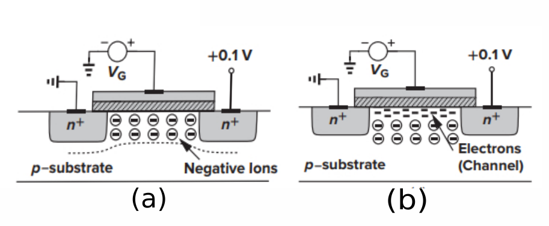
```

Դիտարկենք նկարում պատկերված արտաքին լարումներին միացված ՆՄՕԿ֊ը։ Երբ
փականի պոտենցիալը հարթակի նկատմամբ մեծանում է, $\pmb{\varphi>0}$ հարթակի
ազատ լիցքակիրները խոռոչները սկսում են վանվել ներքև թողնելով բացասական
իոններ՝ ստեղծվում է աղքատացված տիրույթ։ Այսպիսով որքան մեծանա
$\pmb{\varphi}$֊ն ՝այնքան ավելի կհաստանա աղքատացման տիրույթը, հետևաբար
խոռոչների կոնցենտրացիան հարթակի ներքևում ավելի կմեծանա։
$\pmb{\varphi}$֊ի բավարար մեծ արժեքի դեպքում օքսիդի տակ սկսում է իհայտ
գալ ազատ էլեկտրոններ, որոնց մի մասը ակունքիցից են հոսել, իսկ մի մասը՝
հարթակից։ Այսպիսով ակունքի և ըմբիչի միջև առաջանում է հոսքուղի։ Այս
երևույթը հաճախ անվանում են նաև կիսահաղորդչի տիպի շրջում։

**$V_{gs}$֊ի այն փոքրագույն լարումը, որի դեպքում առաջանում է հոսքուղի, «տեղի է
ունենում ինվերսիա»՝ կոչվում է շեմային լարում:**

```{=tex}
\begin{equation} 
  V_{TH} = 𝜱_{MS} + 2 𝜱_F + \frac{Q_{dep}}{C_ox}
  (\#eq:1)
\end{equation}
```
Որտեղ՝

-   $𝜱_{MS}$֊ը հարթակի և փականի աշխատանքային ֆունկցիաների տարբերությունն
    է։
-   $𝜱_F = \frac{kT}{q} \ln{\frac{N_{sub}}{n_i}}$
    -   $k$֊ն Բելցմանի հաստատուն։
    -   $N_{sub}$֊ը հարթակի լիցքակիրների կոնցետրացիան **«doping
        density»**:
    -   $n_i$֊ը մաքուր կիսահաղորդիչ հարթակի լիցքակիրների կոնցետրացիան
        **«udoping density»**:
-   $C_{ox}$֊ը միաոր մակերես ունեցող հաթակ օքսիդ ըմբիչ կոնդեսատորի
    ունակությունն է։
-   $Q_dep$֊ը աղքատացման տիրույթի իոնների լիցքն է։

Ներկայումս, երբ տրանզիստորների չափերը համենատելի են ատոմի չափերին շատ
դժվար է տալ բանաձև ոչ միայն շեմային լարման, այլ նաև ՎԱԲ֊ի և այլ
բնութագրերի համար, այդ պատճառով պարամետրերը հաճախ **գնահատում** են
օգտվելով վիճակագրական մեթոդներից։

## Վոլտ֊Ամպեռային բնութագիրը։

ՄOԿ տրանզիստորի վոլտ֊Ամպեռային բնութագրի մասին խոսելիս կուզենաինք նշել մի կարևոր 
հատկություն որը ևս պատճառներից մեկն է ինտեգրալ սխեմաներում դոմինանտ լինելու։ 
ՄՕԿ֊ի փականի պոտենցիալի բավարար արժեքի դեպքում երբ ձևաորվել է հոսքուղի, փականով հոսանք 
չի անցնում։ Միարժամանակ ըմբիչ ակունք հոսանքի համար անհրաժեշտ բոլոր պայմանները ստեղծված 
են «Տրանզիստորը բաց է» իտարբերություն երկբևեռ տրանզիստորների որը բաց է միայն այն դեպքում 
երբ բազաից էմիտոր անցնում է հոսանք։

Դիտարկենք նկարներում պատկերված արտաքին լարումներին միացված երկու դեպքերը։

::: {.cols data-latex=""}

::: {.col data-latex="{0.45\\textwidth}"}
```{r, echo=FALSE, out.width="100%", fig.align='center', fig.cap='...'}
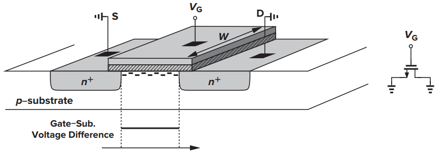
```
Երբ ակունքի և ըմբիչի պոտենցիալները իրար հավասար են՝ 
```{=tex}
\begin{align}  
  Q_d = WC_{ox}(V_{GS} - V_{TH})
\end{align}
```
:::

::: {.col data-latex="{0.1\\textwidth}"}
  <!-- an empty Div (with a white space), serving as
a column separator -->
:::

::: {.col data-latex="{0.45\\textwidth}"}
```{r, echo=FALSE, out.width="100%", fig.align='center', fig.cap='...'}
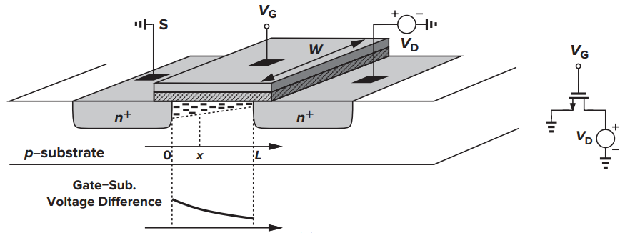
```
Երբ $V_{DS>0}$ հոսքուղու որևէ $x$ կետում՝

```{=tex}
\begin{align} 
  Q_d(x) = WC_{ox}(V_{GS} - V(x) - V_{TH})
\end{align}
```
:::

:::

Այժմ ենթադրենք, որ ունենք N տիպի բավական երկար կիսահաղորդիչ, որը տեղադրված է
համասեռ մեկ միավոր էլ․ դաշտում։ Ակնհայտ լիցքակիրները կսկսեն արագանալ,
սակայն տեղի են ունենում բախումներ, այդ պատճառուվ որոշները կանգ կառնեն և
նորից կսկսեն արագանալ։ Որոշները կարող են ընդհանրապես հանդիպել խոռոչի և
զբաղեցնել ազատ տեղը։ Այսպիսով որպիսի կարողանանք բնութագրենլ շարժումը
ներմուծենք լիցքի շարժողականություն մեծությունը, որը միջինացված արժեք է և
ցույց է տալիս, թե միջինում ինչ արագությամբ է շարժվում լիցքակիրը արտաքին
էլ․ դաշտի ազդեցության տակ $μ_n = \frac{V}{E}$։ Շարժողականություն բարձրացման համար 
կիրառվում են տարբեր մեթոդներ, որից մեկը կիսահաղորդչի բյուրեղային ցանցի նոսրացումն է։ 
Ամբողջ միտքը կայանում է նրանում որ ատոմների միջև հեռաորությունը մեծացնելով փոքրանում է 
բախումների հավանականությունը։

Երբ հայտնի է ազատ լիցքակիրների բաշխվածությունը օգտվելով էլ․ հոսանքի
սահմանումից կստանանք՝

```{=tex}
\begin{equation} 
  I_{D} = μ_n C_{ox} \frac{W}{L}[(V_{GS} - V_{TH})V_{DS} - \frac{1}{2}V_{DS}^2]
  (\#eq:2)
\end{equation}
```
Ստացված $(1.2)$ Արտահայտությունը ըստ $V_{DS}$֊ի մեկ մեծագույն ունեցող
քառակուսի հավասարում է, որը իր առավելագույն արժեքը ընդունում է
$V_{DS} = V_{GS} - V_{TH}$֊ի դեպքում «overdrive voltage»։ Առավելագույն հոսանքը կլինի՝

```{=tex}
\begin{equation} 
  I_{D, max} = \frac{1}{2} μ_n C_{ox} \frac{W}{L} (V_{GS} - V_{TH})^2
  (\#eq:3)
\end{equation}
```

$V_{DS}$֊ի մինչև $V_{GS} - V_{TH}$ արժեքը ասում ենք որ սարքը գտնվում է տրիոդային 
ռեժիմում։ Երբ $V_{DS} \ll 2 (V_{GS} - V_{TH})$ $(1.2)$֊ը կարող ենք գրել՝

```{=tex}
\begin{equation} 
  I_{D}  ≈ \frac{1}{2} μ_n C_{ox} \frac{W}{L} (V_{GS} - V_{TH}) V_{DS}
  (\#eq:4)
\end{equation}
```
Ստացվում է Տրիադ ռեժիմում ՄՕԿ֊ի ելքային ՎԱԲ֊ը «ակունք ըմբիչ» կարող ենք  մոտարկել որպես 
գծային դիմադրություն։ Որքան $V_{DS}$֊ը փոքր լինի այդքան մոտարկման ճշտությունը բարձր կլինի։

```{r, echo=FALSE, out.width="100%", fig.align='center', fig.cap='...'}
knitr::include_graphics("imige/triode.png")
```
Տրիադ ռեժիմում ակունք ըմբիչ դիմադրությունը հավասար կլինի՝
 
```{=tex}
\begin{equation} 
  R = \frac{1}{ μ_n C_{ox} \frac{W}{L} (V_{GS} - V_{TH})}
  (\#eq:5)
\end{equation}
```
Այսպիսով ՄՕԿ տրանզիստորը կարող ենք ոգտագործոլ որպես դիմադրություն որի արժեքը 
ղեկավարվում է փականի լարումով։ 

Այժմ պարզենք թե ինչ է տեղի ունենում երբ $V_{DS} > V_{GS} - V_{TH}$:

```{r, echo=FALSE, out.width='100%', fig.align='center', fig.cap='...'}
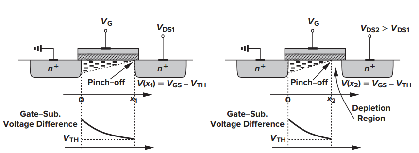
```

Նկ․ 1.6 ում պատկերված հոսքուղում լիցքերի բաշխվածությունը։ Ինչպես տեսնում
ենք, երբ $V_{DS} > V_{GS} - V_{TH}$ հոսքուղու որևէ $X$ կետից սկսած այլևս
փականի պոտենցիալը բավարար չէ հարթակում ինվերսիա առաջացնելու համար՝
արդյունքում հոսքուղին կտրվում է։ Ըմբիչից մինչև կտրման կետը ձևաորվում է աղքատացման 
տիրույթ։ Այժմ կարող ենք մտովի պատկերացնել թե ինչ կլինի էլեկտրոնի հետ եթե ինչ որ կերպ 
կարողանանք այն ներմուծեմք նշված հատվածը։ Դրանք շատ արագ կհոսեն դեպի ըմբիչ։ 
Ըմբիչով անցնող հոսանքը չի հետևում 
պարաբոլին։ Քանի որ լիցքերը բավական արագացած կլինեն կտռման կետում, դրանց
մի մասը հասնում է ըմբիչ։ Այս երևույթը կոչվում է թունելային անցում։
1.2֊ը՝ Ստացվել է հոսքուղու ամբողջ երկարությամբ Ինտեգրման արդյունքում
ուստի անհրաժեշտ է ինտեգրել մինչև այն $X$ կետը, որտեղ հոսքուղին ընհատվում
է։

```{=tex}
\begin{equation} 
  I_{D}  = \frac{1}{2} μ_n C_{ox} \frac{W}{L'} (V_{GS} - V_{TH})^2
  (\#eq:6)
\end{equation}
```
1.6 արտահայտության մեջ $L'$֊ը հաճախ փոխարինում ենք $L$֊ով։ երբ
$V_{DS} > V_{GS} - V_{TH}$ անվանում են տրանզիստորի հագեցման ռեժիմ։ Այս
ռեժիմում $I_D$֊ը կախված չէ $V_{DS}$֊ց։

Բոլոր հետևությունները վերաբերվում են նաև ՊՄՕԿ տրանզիստորներին, միայն պետք
է հիշել, որ փականի պոտենցիալը պետք է ավելի փոքր լինի քան ակունքի
պոտենցիալը, հետևաբար ՎԱԲ֊ի մեջ պետք է ավելացնել $-$ նշանը։

### Հոսքուղու մոդուլացիա։

Ինչպես ցույց է տրված նկ. (1.6) ըմբիչի պոտենցիալի բարձրացմանը զուգահեռ ավելի փոքրանում է 
հոսքուղու էֆեկտիվ երկարությունը և աստիճանաբար մոտենում է ակունքին։ $L'$֊ի փոքրացումը 
բերում է նրան որ մեծանում է ըմբիչով անցնող հոսանքը։ Այս երևույթը կոչվում է հոսքուղու 
երկարության մոդուլացիա։ Իրականում 1.6 արտահայտության մեջ $V_{DS}$ մասնակցում է քանի որ 
$L'$ էֆեկտիվ երկարությունը կախված է «ֆունկցիա է» $V_{DS}$֊ից։ հոսքուղու Էֆեկտիվ 
երկարությունը որոշվում է $L' = L - \Delta L$ որտեղ $\Delta L$֊ը ախքատացման  տիրույթի 
երկարությունն է: $\Delta L / L = λ V_{DS}$ որտեղ $λ$֊ն ՄՕԿ֊ի հոսքուղու երկարության 
մոդուլացիաի գործակիցն է։    

```{=tex}
\begin{equation} 
  I_{D}  ≈ \frac{1}{2} μ_n C_{ox} \frac{W}{L} (V_{GS} - V_{TH})^2(1 + λ V_{DS})
  (\#eq:7)
\end{equation}
```

::: {.cols data-latex=""}

::: {.col data-latex="{0.45\\textwidth}"}
```{r, echo=FALSE, out.width="1500px", fig.align='center', fig.cap='...'}
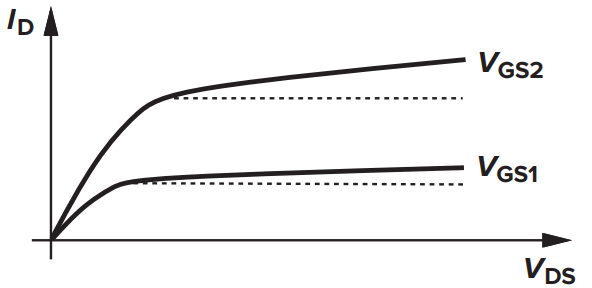
```
:::

::: {.col data-latex="{0.1\\textwidth}"}
  <!-- an empty Div (with a white space), serving as
a column separator -->
:::

::: {.col data-latex="{0.45\\textwidth}"}
Նկարում պատկերված է հոսքուղու երկարության մոդուլացիաի էֆեքտը։ Ըմբիչ ակունք լարման 
փոփոխությունը բերում է ըմբիչով անցնող հոսանքի փոփոխության։ Քանի որ հոսանքի փոփոխությունը 
պայնանաորված է հոսքուղու էֆեքտիվ երկարության փոփոխությամբ դժվար չէ գալ այն եզրակացության որ 
որքան երկար լինի ՄՕԿ֊ի հոսքուղին այնքան փոքր կլինի $λ$-ն։
:::

:::


### Body էֆեքտ։

վերևում մենք ենթադրել էինք, որ հարթակը և ակունքը իրար են միացված և ունեն
նույն պոտենցիալը։ Նկ․ պատկերված է ՆՄՕԿ, որի հարթակը միացված է ավելի ցածր
պոտենցիալի։

```{r, echo=FALSE, out.width='100%', fig.align='center', fig.cap='...'}
knitr::include_graphics("imige/body.png")
```

Քանի որ աղքատացման տիրույթը ստեղծում է փական հարթակ պոտենցիալների
տարբերության հետևանքով՝ ուստի երբ հարթակի պոտենցիալը ավելի փոքր է,
աղքատացման տիրույթը պետք է ավելի լայն լինի, ինչպես պատկերված է նկարում։
Այսպիսով փականի նույն պոտենցիալի դեպքում ավելի շատ բացասական իոններ
կլինեն օքսիդի տակ 1.1֊ ում՝ $V_{TH}$֊ը ֆունկցիա է աղքատացման տիրույթի
լիցքից նշանակում է՝ շեմային լարումը պետք է մեծանա։ Այս ֆենոմենը կոչվում է
մարմնի «Body» էֆեքտ։

```{=tex}
\begin{equation} 
  V_{TH} = V_{TH0} + \pmb{\gamma} (\sqrt{2𝜱_{F} + V_{SB}} + \sqrt{|2𝜱_{S}|})
  (\#eq:8)
\end{equation}
```
Որտեղ՝

-   $V_{TH0}$֊ն այն շեմաին լարումն է երբ հարթակը և փականը իրաի են
    միացված։
-   $V_{BS}$֊ը հարթակ փական լարումն է։
-   $\pmb{\gamma} = \frac{\sqrt{2 q \epsilon_{si} N_{sub}}}{C_{ox}}$:


### Ենթաշեմային հաղորդականություն

ՄՕԿ-ի ՎԱԲ֊ի վերլուծության ժամանակ մենք ենթադրել ենք, որ սարքն անջատվում է՝ ըմբիչով 
հոսանք չի անցնում երբ փականի լարումը փոքր է շեմաին լարումից։ 
Իրականում փականի $V_{GS} ≈ V_{TH}$-ի պոտենցիալների դեպքում հոսքուղում ձևաորվում է 
«թույլ» ինվերսիոն շերտ և որոշակի էականորեն փոքր հոսանք հոսում է ըմբիչից դեպի ակունք: 
Նույնիսկ $V_{GS} < V_{TH}$-ի դեպքում $I_D$-ը հոսանքը փոքր բայց զրո չէ։ 
$I_{D}$-ը փականի պոտենցիալի ենթաշեմային միջակայքում ցուցադրում է էքսպոնենցիալ 
կախվածություն։ Որքան մեծ է ըմբիչի պոտենցիալը այդքան ենթաշեմային հոսանքը մեծ կլինի։

```{=tex}
\begin{equation} 
 I_D = I_0 \exp{\frac{V_{GS}}{ξ V_{T}}}
  (\#eq:9)
\end{equation}
```
Որտեղ  $I_{0}$֊ն համեմատական է $W/L$֊ին , $ξ > 1$ գործակից է որը ցույց է տալիս թե որքան 
է ՄՕԿ֊ը տարբերվում իդեալականից, $V_{T} = kT/q$: Ենթաշեմային հեսանքները սկսում են կարևոր 
դեր խաղալ երբ սխեմայում առկա է միլիոնաոր ՄՕԿ֊էր։   

## ՄՕԿ փոխանցման գործակից «Transconductance»:

Հագեցման ռեժիմում, ինչպես ցույց է տրված (1.6)֊ում ըմբիչի հոսանքը, կախված է
ըմբիչ ակունք պոտենցիալների տարբերությունից։ ՄՕԿ֊ը իրեն դրսևորում է
ինչպես հոսանքի աղբյուր։ Որպես փոխանցման գործակից սահմանենք ազդեցության
$V_{GS}$ փոփոխության հետևանքով արձագանքի $I_D$ փոփոխությունը, երբ
$V_{DS} = Const$

```{=tex}
\begin{equation} 
  g_m = \frac{\partial I_D}{\partial V_{GS}} =  μ_n C_{ox} \frac{W}{L} (V_{GS} - V_{TH})
  (\#eq:10)
\end{equation}
```
```{r, echo=FALSE, out.width='100%', fig.align='center', fig.cap='...'}
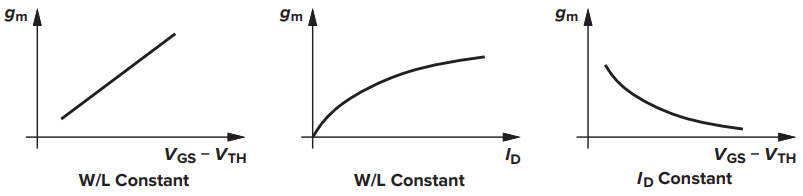
```

Նկարում պատկերված է փոխանցման գործակցի կախվածությունը պարամետրերից։

## ՄՕԿ փոքր ազդանշան «Small-Signal» մոդել:

Ինչպես հայտնի է կիսահաղորդչային սարքերը ոչ գծային տարեր են։ Այն Շղթաները,
որոնք պարունակում են ոչ գծային տարեր հաշվարկները հիմնականում մոտավոր են։
ՎԱԲ֊ի համար ստացված բոլոր արտահայտությունը շատ կարևոր են
շղթաների նախագծման, հետազոտման համար: Իրականում կան ՎԱԲ֊ի այլ
արտահայտություններ, որտեղ օրինակ՝ հաշվի է առնված այն, որ ակունքը, հարթակը
և ըմբիչը կազմում են երկբևեռ տրանզիստոր։ Սակայն հարց է առաջանում, թե որքան
է դա կարևոր շղթայի աշխատանքի համար։ Կախված ազդանշանի փոփոխման չափից
հաշվարկների պարզեցման համար ՄOԿ֊ի իրական ՎԱԲ֊ի փոխարեն օգտվում ենք ՄՕԿ֊ի
փոքր ազդանշան մոդելից, ըստ որի ազդեցության փոքր փոփոխություն պատճառով
արձագանքի փոփոխության միջև կապը գծային է։ 

Փոքր֊ազդանշան մոդելը կառուցելու համար 
շղթային միացված լարումները «հոսանքները» ներկայացվում են որպես երկու հաստատուն և 
փոփոխական մասերի գումար։ Բոլոր հաստատուն բաղադրիչները միասին ընտրում են շղթաի 
**«աշխատանքային կետը»։** 
Երբ ընտրված է աշխատանքային կետը անկախ հաստատուն աղբյուրները այլևս ոչ մի ազդեցություն 
չունեն ժամանակի ընթացքում տեղի ունեցող փոփոխություննների վրա։ փոփոխական մասի 
հետազոտման համար պետք է հասկանանք թե որ տարը ինչ դեր է կատարում հաստատուն մասի «թելադրած» 
աշխատանքային կետում։ Անկախ հաստատուն լարման աղբյուրները փոխարինվում են իրենց համարժեք 
ներքին դիմադրությամբ իդեալական դեպքում կարճ միացմամբ։ Հաստատուն հոսանքի աղբյուրները 
իրենց ներքին դիմադրությամբ իդեալական դեպքում «կտրած լարով»։ ՄՕԿ֊ի փոփոխական բաղադրիչին
համարժեքը կախված է հաստատուն մասի թողած ազդեցությունից՝ արդյոք ինչ ռեժիմում է գտնվում 
ՄՕԿ֊ը։ Փակ ռեժիմում ակունք֊ըմբիչին համարժեք է կտրած լարը։

::: {.subtitle data-latex=""}
**Տրիոդ ռեժիմ՝**
:::

::: {.cols data-latex=""}

::: {.col data-latex="{0.45\\textwidth}"}

```{r, echo=FALSE, out.width="1500px", fig.align='center', fig.cap='...'}
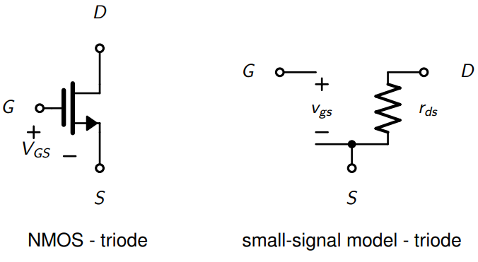
```
:::

::: {.col data-latex="{0.1\\textwidth}"}
  <!-- an empty Div (with a white space), serving as
a column separator -->
:::

::: {.col data-latex="{0.45\\textwidth}"}
Տրիոդ ռեժիմում ինչպես հայտնի է ՄՕԿ֊ի ակունք ըմբիչին համարժեք տարրը ռեզիստորն է 
որի դիմադրությունը որոշվում է փականի լարման հաստատուն բաղադրիչով։
:::

:::

```{=tex}
\begin{equation} 
  R_{eq} = \frac{1}{ μ_n C_{ox} \frac{W}{L} V_{GS}} 
  (\#eq:10)
\end{equation}
```
::: {.subtitle data-latex=""}
**Հագեցման ռեժիմ։**
::: 

Հագեցման ռեժիմում ՄՕԿ֊ի ակունք֊ըմբիչը չի ենթարկվում Օհմի օրենքին այն իրենից ներկայացնում է
ակտիվ տար, որով անցնող հոսանքը որոշվում է փականի լարումով։ փականի լարման հաստատուն մասին 
համապատասխանող աշխատանքային կետում ՎԱԲ֊ին տարված շոշափողի անկյունային գործակիցը $g_{m}$ 
է։ Որպիսի կարողանանք ՎԱԲ֊ը ապրոկսիմացնենք շոշափողին անհրաժեշտ է որ փոփոխական մասի 
ամպլիտուդը փոքր լինի։

::: {.imgzoom}
```{r, echo=FALSE, out.width="1500px", fig.align='center', fig.cap='...'}
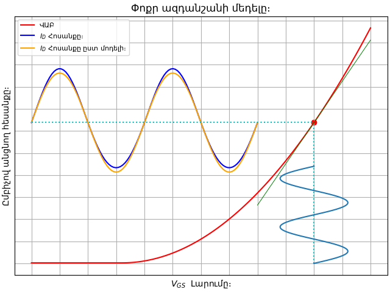
```
:::

Նկարում պատկերված է ազդանշանի երկու արձագանքները որից մեկը ըստ փոքր ազդանշանի է, իսկ 
միուսը ըստ ՎԱԲ֊ի։ 

::: {.cols data-latex=""}
::: {.col data-latex="{0.45\\textwidth}"}

```{r, echo=FALSE, out.width="1500px", fig.align='center', fig.cap='...'}
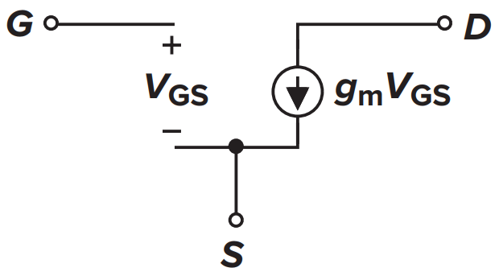
```
:::

::: {.col data-latex="{0.1\\textwidth}"}
  <!-- an empty Div (with a white space), serving as
a column separator -->
:::

::: {.col data-latex="{0.45\\textwidth}"}

Նկարում պատկերված է փոքր ազդանշանի պարզագույն մոդելը ըստ որի փականի լարման փոփոխությանը 
համապատասխան ըմբիչի հոսանքի փոփոխությունը գծային է $I_{DR} = g_{m}V_{GS}$։  Որտեղ 
$V_{GS}$֊ասելով ինկատի ունենք մուտքի լարման փոփոխությունը։ 

:::
:::

Ինչպես ՎԱԲ֊ի ուսումնասիրման ժամանակ մենք սկսեցինք հաշվի առնել երկրորդային էֆեկտները 
այնպես էլ փոքր ազդանշանի մոդելաորման ժամանակ ավելի ճշգրիտ հաշվարկներ ստանալու համար 
կարող ենք մոդելաորել նաև այդ էֆեկտները։ ՆԿ (1.11) **«իդեալական»** ՄՕԿ֊ի մոդելն է։ 
Որպես այդպիսի երկրորդային էֆեքտ մեդելին ավելացնենք հոսքուղու երկարության մոդուլացիան։ 


::: {.cols data-latex=""}
::: {.col data-latex="{0.45\\textwidth}"}

```{r, echo=FALSE, out.width="1500px", fig.align='center', fig.cap='...'}
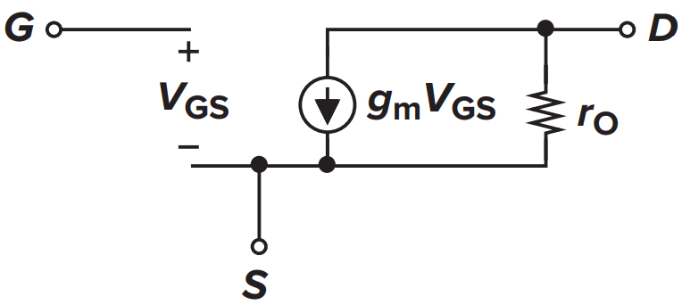
```
:::

::: {.col data-latex="{0.1\\textwidth}"}
  <!-- an empty Div (with a white space), serving as
a column separator -->
:::

::: {.col data-latex="{0.45\\textwidth}"}
Այն հետևանքը որը թողնում է հոսքուղու երկարության մոդուլացիան կարող ենք մոդելաորել որպես 
ռեզիստոր միացված ակունք ըմբիչին։ Իսկապես չէ որ ըմբիչ ակունք լարման բարձրացմանը զուգահեռ 
մեծանում է ըմբիչով անցնող հոսանքը։ 
:::
:::

```{=tex}
\begin{equation} 
  r_0 = \frac{\partial V_{DS}}{\partial I_D} =  
  \frac{1}{\frac{1}{2} μ_n C_{ox} \frac{W}{L} (V_{GS} - V_{TH})^2 λ} ≈ \frac{1}{λ I_D}
  (\#eq:11)
\end{equation}
```


Հաջորդ երկրորդային էֆեքտը որը կարիք է առաջանում  ավելացնել մոդելին դա մարմնի էֆեքտն է։ Որպիսի 
պարզենք ինչ տար կարող ենք ավելացնել պատկերացնենք որ բոլոր պոտենցիալներտ ֆիքսված են իսկ 
հարթակի պոտենցիալը փոքրացնում ենք։ Ինչպես արդեն նշել էինք զուգահեռ սկսում է մեծանալ 
շեմաին լարումը որը պատճառ է հանդիսանում անցնող հոսանքի փոփոխության։ Նշանակում է կարող 
ենք մոդելաորել որպես հոսանքի աղբյուր որը ղեկավարվում է հարթակ ակունք պոտենցիալով։

```{r, echo=FALSE, out.width="100%", fig.align='center', fig.cap='...'}
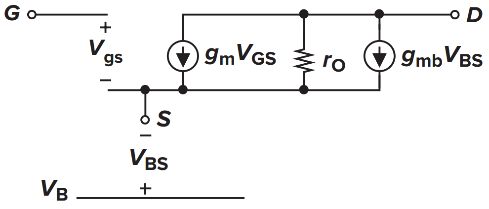
```


```{=tex}
\begin{equation} 
g_{mb} = η g_m
  (\#eq:12)
\end{equation}
```
Որտեղ $η = g_{mb}/g_{m}$ և սովորաբար 0.25֊ի կարգի մեծություն է։ 

## ՄՕԿ «Spice» մոդել:

«Spice»-ը ծրագրային ապահովում է, որի առաջին տարբերակը թողարկվել է 1973
թվականին։ «Spice»-ը թույլ է տալիս կառուցել սխեմաի մաթեմատիկական մոդելներ,
կատարել տարբեր տեսակի հետազոտություններ։ Որպիսի հաշվիչ մեքենան կարողանա
կառուցել սխեմաի մոդելը անհրաժեշտ է տալ ամբողջ շղթաի spice նկարագրությունը «netlist»։ 
Նկարագրությունը իրեն հատուկ կանոններով գրված փաստաթուղթ է որտեղ պետք է նշվեն օգտագործվող 
տարի ելուսների միացումները և այդ տարի մոդելը։ ՄՕԿ֊ի միացման համար սահմանված է՝ 
`name drain gate source bulk model` հերթականությունը։ մոդելը ըստ էության սարքի 
նկարագրությունն է որը կարող է գրված լինել տարբեր լեզուներով։ Նույն ՄՕԿ֊ի համար կարող է 
նախորոք պատրաստված լինել տարբեր մակարդակի նկարագրություններ։ Տարբեր մոդելներ ունենալու 
իմաստը կայանում է նրանում որ spice հետազոտությունը բավական ժամանակ և ռեսուրսներ է 
պահանջում ուստի որքան «պարզ» լինի մոդելը այդքան արագ կլինի հետազոտությունը։ Այսպիսով 
կախված սխեմաի տեսակից թվային է թե անալոգային, հետազոտության նպատակից կարող են ընտրվել 
տարբեր մոդելներ նույն ՄՕԿ֊ի համար։ Մոդելների մակարդակների մասին ավելի մանրամասն 
տեղեկություն կարող եք ստանալ [Synopsys](https://www.synopsys.com/){target="_blank"} ընկերության 
[HSPICE models manual](https://people.engr.tamu.edu/spalermo/ecen474/hspice_mosfet.pdf){target="_blank"} 
ձեռնարկից։ 
ՄՕԿ֊ի spice մոդելներ կազմելը նույնպես շատ կարևոր գործնթաց է և որքան մոդելը ճշգրիտ է 
բնութագրում իրական սարքին այդքան մեծ է երաշխիքը որ նախագծման փուլում spice հետազոտության 
և արտադրված ինտեգրալ սխեմաի արձյունքները նույնը կլինեն։ ՄՕԿ֊ի Ներկաիս ֆիզիկական չափսերի 
փոքրացումը, արտադրական պռոցեսներում որոշ պարամետրերի պատահական շեղումները բերել է նրան 
որ այդքան էլ հեշտ չէ միանշանակ բնութագրել ՄՕԿ֊ին։ Որպիսի նախագծողը համոզված լինի, որ 
արտադրությունից հետո սխեման կբավարարի բոլոր պահանջներին օգտվում են վիճակագրական 
մեթոդներից։ Դիցուկ  հոսքուղու երկարությունը $L$ միջինով և $σ$ 
ստանդարտ շեղումով նորմալ բաշխվածությամբ պատահական մեծություն է։ Որպիսի spice հետազոտության 
մեջ ներառվի նաև պատահական վարիացիաները oգտվում են [Monte Carlo](https://en.wikipedia.org/wiki/Monte_Carlo_method){target="_blank"} 
մեթոդից։


Նկ (1.14)֊ում պատկերված է spice մոդելի տոպոլոգիան։ Այս տոպոլոգիան կարող է փոփոփշխվել 
կախված մոդելի մակարդակից։


```{r, echo=FALSE, out.width='100%', fig.align='center', fig.cap='...'}
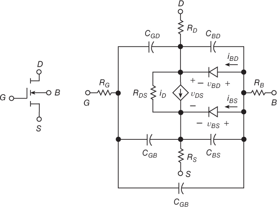
```

Այս աշխատանքում, որպես մոդելաորման միջոց օգտագործվել է
[NgSpice](https://ngspice.sourceforge.io/){target="_blank"}, իսկ որպես գրադարան՝ «Google»
և «SkyWater» ընկերությունների համատեղ թողարկած
[130նմ](https://skywater-pdk.readthedocs.io/en/main/versioning.html#current-status){target="_blank"}
գրադարանից: Նշված ծրագրային ապահովումները թողարկվել են ուսումնական
նպատակներով և դրանց ճշտությունը բավարար չէ կոնվերցիոն նպատակներով
օգտագործվել համար։

Որպես եզրափակիչ մաս ՄOԿ֊ի ՎԱԲ֊ի հետազոտման համար կազմվել է netlist կատարվել է «DC» 
հետազոտություն որի արձյունքները ամփոփված է նկարի հղումում։

[ 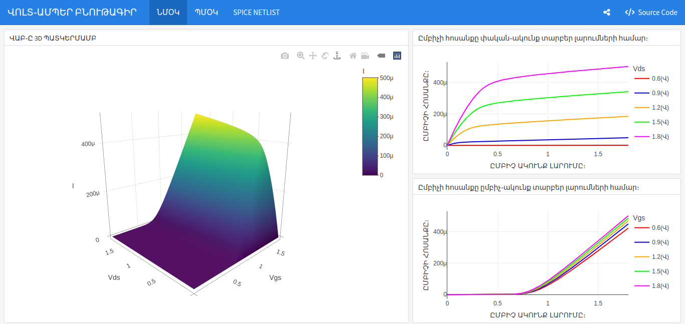 ](vab.html){target="_blank"}


