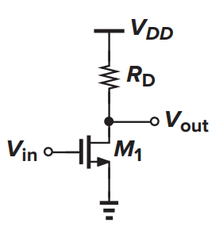
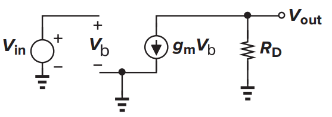
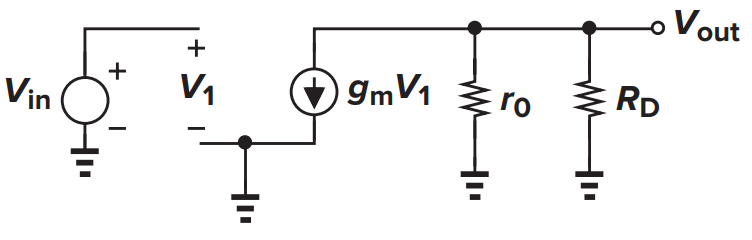
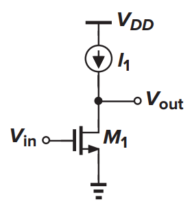
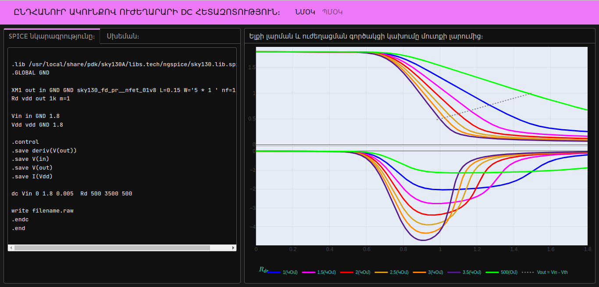
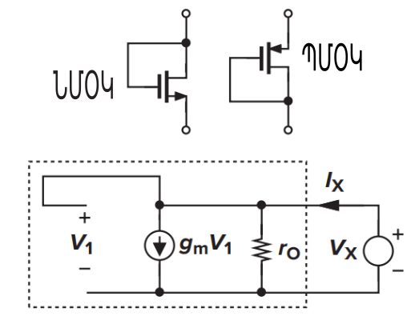
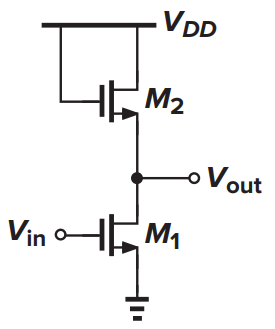
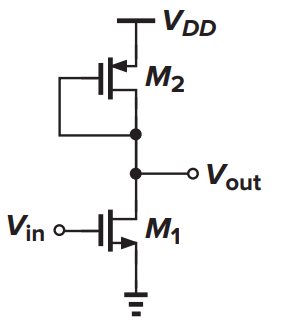
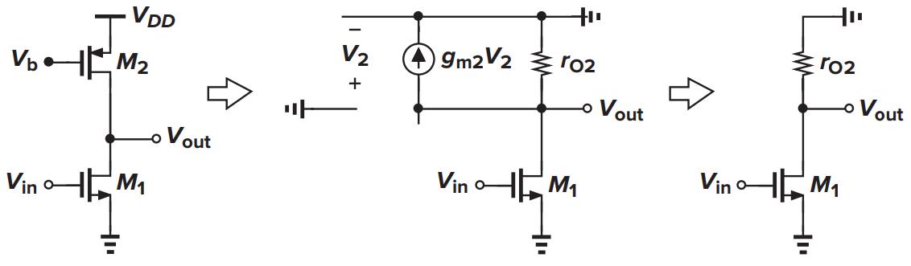
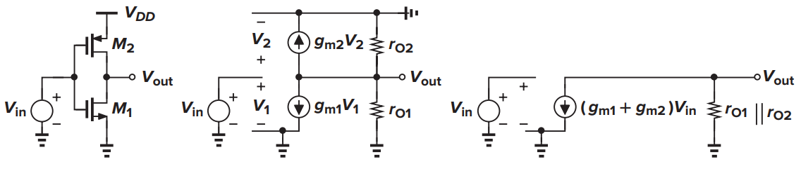

```{r  include=FALSE}
library(plotly)
library(ggplot2)
```

# Մեկ տրանզիստորով «Single-Stage» ուժեղարարներ։

ՈՒժեղացումը էական ֆունկցիան է անալոգային (և շատ թվային) սխեմաներում։ 
ազդանշանի մակարդակը կարող է շատ փոքր լինել բեռին միացնելու համար։ հնարավոր է նաև ունենա 
բարձր թվային արժեք, սակայն ելքային մեծ դիմադրության պատճառով կրկին չկարողանա բեռի վրա 
թողնել անհրաժեշտ ազդացությունը։ ՈՒժեղարարների ուսումնասիրումը կսկսենք պարզագույն 
**ընդհանուր ակունքով** ուժեղարարներից։

## Ընդհանուր ակունքով ուժեղարար։

:::{.img-text-box}

:::{.imige-right}



<p class="caption">Նկ․ (2.1)։</p>
:::

:::{.text-box}

ՄՕԿ տրանզիստորի և ռեզիստորի նկ (2.1) պատկերված կոմբինացիան հանդսանում է ընդհանուր ակունքով 
«Common-Source» ուժեղարարար։ ՄՕԿ֊ի ՎԱԲ֊ից հայտնի է որ փականի պոտենցիալի փոփոխությունը 
բերում է ըմբիչով անցնող հոսանքի փոփոխության։ Ըմբիչով անցնող Հոսանքը ընդհանուր է և նույն 
հոսանքը անցնում է նաև դիմադրությունով, որը ելքում ստեղծում է պոտենցիալի փոփոխություն: 
Երբ մուտքի լարումը $V_{in} < V_{TH}$   $M_1$ տրանզիստորը փակ կլինի նշանակում 
է շղթայով հոսանք չի անցնի հետևաբար $V_{out} = V_{DD}$: Մուտքային լարման  $V_{in}> V_{TH}$ 
արժեքների համար ՄՕԿ֊ը դուրս է գալիս փակ ռոժիմից և շղթայով սկսում է հոսանք անցնել,
որի պատճառով ելքի լարումը կփոքրանա։ 
երբ $V_{out}>V_{in} - V_{TH}$ ՄՕԿ֊ը հագեցման ռեժիմում է հետևաբար՝ 

:::

:::


```{=tex}
\begin{equation} 
  V_{out}  = V_{DD} - R_{D} \frac{1}{2} μ_n C_{ox} \frac{W}{L} (V_{in} - V_{TH})^2
  (\#eq:1)
\end{equation}
```
[2.1]֊ում հաշվի առնված չէ հոսքուղու մոդուլացիան։ Մուտքային լարման հետագա մեծացումը կբերի նրան որ 
 $V_{out} < V_{in} - V_{TH}$ և ՄՕԿ֊ը կգտնվի գծային **Triode** ռեժիմում հետևաբար՝

```{=tex}
\begin{equation} 
  V_{out}  = V_{DD} - R_{D} \frac{1}{2} μ_n C_{ox} \frac{W}{L} [2(V_{in} - V_{TH})V_{out} - V_{out}^2]
  (\#eq:2)
\end{equation}
```
ՈՒժեղարարների նափագծման ժամանակ պետք է համոզվել ու ՄՈԿ֊ը գտնվում է հագեցման ռեժիմում։ 
Քանի որ գծային ռեծիմում ըմբիչի հոսանքը կախած է նաև ըմբիչի լարումից $\pmb{V_{out}}$֊ից 
«ՄՕԿ֊ը հանդես է գալիս որպես ղեկավարվող դիմադրություն» ստացվում է ելքի արժեքը կախված է 
ելքից **«ոչ ցանկալի հետադարց կապ»**  ինչպես նաև կունենանք փոքր ուժեղացման գործակից։

Ուսումնասիրությունները սկսենք փոքր ազդանշան մոդելից։ Եթե  $V_{out}>V_{in} - V_{TH}$  կունենանք՝

```{=tex}
\begin{equation} 
  A_v = \frac{\partial V_{out}}{\partial V_{in}} = - R_{D}  μ_n C_{ox} \frac{W}{L} (V_{in} - V_{TH}) = -g_m R_D
  (\#eq:3)
\end{equation}
```
Պարզ մաթ․ ձևափոխությունների արձյունքում ստացվում եմ հետագայում օգտակար հետևյալ արտահայտությունը՝

```{=tex}
\begin{equation} 
  A_v = - \sqrt{2 μ_n C_{ox} \frac{W}{L} I_D} \frac{V_{RD}}{I_D} = - \sqrt{2 μ_n C_{ox} \frac{W}{L} \frac{1}{I_D}}V_{RD}
  (\#eq:4)
\end{equation}
```
որտեղ $V_{RD}$֊ը դիմադրության վրա ընկած լարման անկումն է։

[2.3] արտահայտության մեջ $g_m$֊ը ՄՕԿ֊ի փոխանցման գործակիցն է ըստ փոքր ազդանշան մոդելի 
ազդանշանը փոքր ամպլիտուդով փոփոխվում է $V_b$ հաստատուն լարման շուրջ։  $V_b$ շեղման 
«bias» լարումը ընտրում է ուժեղարարի աշխատանքային կետը։ Իրականում ազդանշանները 
հիմնականում փոքր ամպլիտուդով ժամանակից կախված մեծություններ են որոնց արժեքը չի 
գերազանցում շեմաին լարումը և անպայման պետք է ավելացնել շեղման լարում։ Այդպիսի ազդանշանի 
օրինակ է բարձրախոսից ստացված ազդանշանը որի թվային արժեքը մվ֊է։ $V_b$ աշխատանքային կետում 
ՄՕԿ֊ի փոխանցման գործակիցը կլինի՝ $g_{mV_b} = μ_n C_{ox} \frac{W}{L} (V_b - V_{TH})$: 
Երբ մութքային ազդանշանը սկսի փոփոխվել զուգահեռ կփոփոխվի նաև ըմբիչով անցնող հոսանքը 
$\partial {I_{D}} = g_m \partial {V_{in}}$ իսկ ելքային լարումը կփոփոխվի $R_D$ անգամ ավել 
միայն երբ $I_D$ մեծանուն է $V_{out}$-ը փոքրանում է։

:::{.imige-center }


<p class="caption">Նկ․ (2.2)։</p>
:::


Իրականում $V_{in}$֊ի փոփոխությունը բերում է $g_m$֊ի փոփոխության և որքան մեծ է մուտքի 
փոփոխությունը այնքան ավելի զգալի է $g_m$֊ի փոփոխությունը որը բերում է անցանկալի  ոչ 
գծաին ձևափոխությունների և այստեղ էլ ինչպես միշտ հրաշքներ չէն լինում և անհրաժեշտ է գնալ 
փողզիջումների քանի որ լավարկելով մի պարամետրը անպայման պետք է տուժի միուսը։

Երբ $g_m$֊ը բավական մեծ է լինում ելքի լարումը մեծ ամպլիտուդով է սկսում փոփոխել քանի որ 
$V_{out} = V_{DS}$ հոսքուղու երկարության մոդուլացիան սկսում է զգալի դեր ունենալ ելքի վրա և 
ավելի մեծ ճշտությամբ հաշվարկներ կատարելու համար կարիք է առաջանում ներառել նաև այն։

```{=tex}
\begin{equation} 
V_{out}= V_{DD} − R_{D}\frac{1}{2} μ_{n}C_{ox} \frac{W}{L}(V_{in} − V_{TH})^2 (1 + λV_{out})\\
(\#eq:4)
\end{equation}
```


```{=tex}
\begin{equation} 
\frac{\partial{V_{out}}}{\partial{V_{in}}} =  -R_{D} μ{n}C{ox} \frac{W}{L}(V_{in} − V_{TH})(1 + λV_{out})\\
 - R_{D}\frac{1}{2} μ{n}C{ox} \frac{W}{L}(V_{in} − V_{TH})^2 λ\frac{\partial{V_{out}}}{\partial{V_{in}}}
  (\#eq:5)
\end{equation}
```

հաշվի առնելով որ՝ $\frac{1}{r_o} = \frac{1}{2} μ{n}C{ox} \frac{W}{L}(V_{in} − V_{TH})^2 λ$ 
ուժեղացման գործակցի համար կունենանք՝

```{=tex}
\begin{equation} 
A_v = -g_m \frac{r_0 R_D}{r_0 + R_D} 
  (\#eq:6)
\end{equation}
```

:::{.imige-center }


<p class="caption">Նկ․ (2.3)։</p>
:::

Նկարում պատկերված է մոդելը որտեղից շատ անգամ ավելի հեշտ ստացվում է [2.6]֊ը։ 

```{=tex}
\begin{equation} 
\frac{V_{out}}{V_{in}} = -g_m R_D || r_0
  (\#eq:7)
\end{equation}
```


:::{.img-text-box}

:::{.imige-right}



<p class="caption">Նկ․ (2.4)։</p>
:::

:::{.text-box}

Որպիսի մեկ ՄՕԿ֊ով ստանանք առավելագույն ուժեղացման գործակից $R_D$-ը պետք է ունենա անվերջ 
մեծ արժեք։ Հնարաոր առավելագույն ուժեղացումը տեղի կունենա երբ ռեզիստորը փոխարինենք հոսանքի 
աղբյուրով։ Ուժեղացման այդ արժեքը կոչվում է սեփական։ 

:::

:::


```{=tex}
\begin{equation} 
A_v = - g_m r_0
  (\#eq:8)
\end{equation}
```
Թվում է թէ առաջանում է հակասություն չէ որ հոսանքի աղբյուրի արժեքը կարող է չհամնկնել $I_D$ 
արժեքին չէ որ մենք ասում էնք ՄՕԿ֊ը նույնպես հոսանքի աղբյուր է սակայն երբ սկսում ենք հաշվի 
առնել հոսքուղու մոդուլացիաի էֆեքտը ամեն ինչ հարթվում է։

```{=tex}
\begin{equation} 
I_1 = \frac{1}{2} μ_{n}C_{ox} \frac{W}{L}(V_{in} − V_{TH})^2 (1 + λV_{out})
  (\#eq:9)
\end{equation}
```
Նախքան հաջորդ միացման անցնելը կազմենք «Spice» նկարագրություն և կատարենք «DC» հետազոտության։ 
Հետազոտության արձյունքները ամփոփված են նկ (2.5)֊ի հղումում։ 


:::{.imige-center-100 }
[ ](comsur.html){target="_blank"}

<p class="caption">Նկ․ (2.5)։</p>
:::
 

### Ընդհանուր ակունքով ուժեղարար փակված դիոդով։

ՈՒժեղացման գործակցի [1.3] արտահայտության մեջ մասնակցում են այնպիսի մեծություններ որոնց 
արժեքը կոռելացված են շղթաի աշխատանքային ջերմաստիճանի հետ հետևաբար ըստ ջերմաստիճանի ուժեզացումը 
անկայուն կլինի։ Այդպիսի մեծություններից մեկը ռեզիստորի դիմադրությունն է ընդ որում որոշ 
ԿՄՕԿ տեխնոլոգիաներում հնարաոր չէ ստանալ անհրաժեշտ դիմադրության արժեք ողջամիտ ֆիզիկական 
չափերով։ Ռեզիստորին փոխարինող տար կարող է հանդես գալ ՄՕԿ տրանզիստորը եթե ըմբիչը և ակունքը 
միացված լինեն իրար։ Այսպիսի միացման դեպքում ՄՕԿ֊ը միշտ կգտնվի հագեցման ռեժիմում։ Նկարում 
պատկերված է «դիոդ» միացման փոքր ազդանշան մոդելը։

:::::: {.cols data-latex=""}

::: {.col data-latex="{0.7\textwidth}"}

```{r, echo=FALSE, out.width="1500px", fig.align='center', fig.cap='...'}

```
:::

::: {.col data-latex="{0.1\\textwidth}"}
  <!-- an empty Div (with a white space), serving as
a column separator -->
:::

::: {.col data-latex="{0.2\textwidth}"}
Որպիսի հաշվենք ՄՕԿ֊ի ակունք―ըմբիչի համարժեք էլեմենտի դիմադրությունը **«impedance»** 
անհրաժեշտ է բոլոր անկախ հոսանքի և լարման աղբյուրները փոխարինել համապատասխանաբար կտրած 
լարով և կարճ միացմամբ։ Այնուհետև սեղմակնրին միացնենք $V_x$ պոտենցիալների տարբերություն 
արդյունքում լարման աղբյուրով դիցուկ անցնող հոսանքը $I_x$ է։ ${\frac{V_x}{I_x}}$ հարաբերությունը 
իրենից կներկայացնի համարժեք դիմադրությունը։
:::
::::::
Երբ անտեսում ենք մարմնի էֆեքտը և հոսքուղու մոդուլացիան ստացվում է ${Z_{0} = \frac{1}{g_m}}$ ։
Երբ չենք անտեսում երկրորդանան էֆեքտները կունենանք զուգահեռ միացում՝


```{=tex}
\begin{equation} 
Z_0 = ( \frac{1}{g_m} )|| (\frac{1}{g_{mb}})|| (r_0)  = \frac{1}{g_m + g_{mb} + r_o^{-1}}
  (\#eq:10)
\end{equation}
```


:::::: {.cols data-latex=""}

::: {.col data-latex="{0.7\textwidth}"}

```{r, echo=FALSE, out.width="500px", fig.align='center', fig.cap='...'}

```
:::

::: {.col data-latex="{0.1\\textwidth}"}
  <!-- an empty Div (with a white space), serving as
a column separator -->
:::

::: {.col data-latex="{0.2\textwidth}"}
Դիտարկենք նկարում պատկերված սխեման առանց հոսքուղու մոդուլացիաի էֆեքտի։

$$ A_v = - g_{m1} \frac{1}{g_{m2} + g_{mb2}} = \frac{g_{m1}}{g_m2} \frac{1}{1+ η} $$
Որտեղ $η = \frac{g_mb2}{g_m2}$: ${g_{m1}}$֊ը և ${g_{m2}}$֊ը փոխարինելով իրենց արժեքներով 
և հաշվի առնելով որ հոսանքը ընդանուր է կունենանք՝ 

:::
::::::

```{=tex}
\begin{equation} 
A_v = - \frac{\sqrt{μ_nC_{ox} {(W/L)}_{1}}}{\sqrt{μ_nC_{ox} {(W/L)}_{2}}} \frac{1}{1+ η}
  (\#eq:11)
\end{equation}
```

եթե ուժեղարարը ինտեգրալ սխեմայում է և սխեմաի ֆիզիկական նախագծման ժամանակ էլեմենտի 
դասաորվածությունը կատարվել է այնպես որ առավելագույնս տրանզիստորները գտնվեն հավասար 
պայմաններում շատ  մեծ ճշտությամբ կարող ենք կրճատել նաև ${μ_nC_{ox}}$֊ը։

```{=tex}
\begin{equation} 
A_v = - \frac{\sqrt{{(W/L)}_{1}}}{\sqrt{{(W/L)}_{2}}} \frac{1}{1+ η}
  (\#eq:12)
\end{equation}
```

Այսպիսով ընդանուր―ակունքով դիոդով միացված ուժեղարարը ունի մի շարք առավելություններ՝

-  Հնարաոր է իրականացնել ինտեգրալ սխեմաներում։
-  համեմատաբար կայուն ուժեղացում անկախ ջերմաստիճանաին տատանումներից։
-  ուժեղացման գործակիցը ավելի թույլ է կոռելացված շեղման լարումից  որի 
արձյունքում ունենք շատ ավելի գծաին ուժեղացում։

Զաիմանալի չէ այն որ մեծ֊ազդանշան մոդելը երբ չէնք կարող 
ՄՕԿ֊ի ՎԱԲ֊ը գծայնացնենք քանի որ մեծ է ազդանշանի ամպլիտուդը ուժեղացման 
գործակցի համար ստանում ենք նույն (2.12) արտահայտությունը։

```{=tex}
\begin{equation} 
 \frac{1}{2}μ_n C_{ox} {(\frac{W}{L})}_{1} (V_{in}- V_{TH1})^2  = \frac{1}{2}μ_n C_{ox} {(\frac{W}{L})}_{2} (V_{DD}- V_{out} - V_{TH2})^2 \\
 \sqrt{{(\frac{W}{L})}_{1}} (V_{in}- V_{TH1}) = \sqrt{{(\frac{W}{L})}_{2}} (V_{DD}- V_{out} - V_{TH2})

  (\#eq:13)
\end{equation}
```
ինչպես տեսնում ենք մութքի և ելքի միջև կախվածությունը գծաին է եթե 
$M_{2}$―ի մարմնի էֆեքտը անտեսենք կամ փոքրացնենք։ (2.13)րը դիֆերենցելով 
ըստ ${V_{in}}$֊ի կստանանք (2.12)֊ը։

Որպես դիոդ միացված $M_{2}$ ՆՄՕԿ֊ը կարող ենք փոխարինել ՊՄՕԿ֊եվ։

:::::: {.cols data-latex=""}

::: {.col data-latex="{0.7\textwidth}"}

```{r, echo=FALSE, out.width="1000px", fig.align='center', fig.cap='...'}

```
:::

::: {.col data-latex="{0.1\\textwidth}"}
  <!-- an empty Div (with a white space), serving as
a column separator -->
:::

::: {.col data-latex="{0.2\textwidth}"}
Արդյունքում ՊՄՕԿ֊ի հարթակը և ակունքը պետք է միացված լինեն բարձր պոտենցիալին 
հետևաբար մերմնի էֆեկտի ազդեցությունը հավասարվում է փոքրագույնի։ Այսպիսի միացման դեպքում 
փոքրանում է ելքային լարման փոփոխման տիրույթը չէ որ $M_{2}$-ի բացվելու համար անհրաժեշտ է 
փականի պոտենցիալը գոնե $V_{TH2}$֊ով փոքր լինի քան աղբյուրի պոտենցիալը 
${V_{out,max} = V_{dd} - V_{TH2}}$: ՈՒժեղացման գերծակցի համար կունենանք՝

:::
::::::

```{=tex}
\begin{equation} 
A_v = - \frac{\sqrt{μ_n {(W/L)}_{1}}}{\sqrt{μ_p {(W/L)}_{2}}}
  (\#eq:14)
\end{equation}
```


### ընդանուր֊ակունք տոպոլոգիան փակված հոսանքի աղբյուրով։

```{r, echo=FALSE, out.width="100%", fig.align='center', fig.cap='...'}

```

Մինչև այժմ մենք ${M_{2}}$ ՄՕԿ֊ը միացնում էինք այնպես որ $V_{GS2}$֊ը կախված էր ելքի 
արժեքից և հետևաբար շղթայով անցնող հոսանքի վրա ուներ ուղղակի ազդեցություն։ նկարում 
պատկերված սխեմայում ${M_{2}}$ ՄՕԿ֊ը հանդես է գալիս որպես հոսանքի աղբյուր և միայն 
երկրորդային էֆեքտներով է անցնող հոսանքը կախված մութքից մասնաորապես  
**հոսքուղու մոդուլացիա**։ Այսպիսի միացման դեպքում նույնպես ելքի արժեքի վրա ավելանում է 
սահմանափակում որպիսի $M_{2}$֊ը լինի հագեցման ռեժիմում անհրաժեշտ է որ 
${V_{out} 	\le  V_{DD} - V_{b} + |V_{TH2}|}$:
 Ինչպես ցույց է տրված նկարում փոքր֊ազդանշան մոդելում  այն 
կարող ենք փոխարինել ${r_{02}}$ դիմադրությամբ։ ՈՒժեղացման գործակիցը կլինի՝

**հարցեր կան պարզելու????**

```{=tex}
\begin{equation} 
A_v = - g_m(r_{01}||r_{02})
  (\#eq:15)
\end{equation}
```

### ընդանուր֊ակունք տոպոլոգիան փակված ակտիվ տարով։

Նկ (2.10)֊ում ՊՄՕԿ֊ի փականը միացված էր հաստատուն լարման արդյունքում իրենից ներկայացնում 
է հաստատուն հոսանքի աղբյուր: Խնդիրը կայանում է նրանում որ արդյոք հնարաոր չէ $M_{2}$֊ը միացնել 
այնպես որ ուժեղացման մեջ ունենա ուղղակի դեր։ Պարզվում է երբ  $M_{2}$֊ի փականը միացված է 
մութքին ինչպես ցույց է տրված Նկ (2.11)֊ում այն վերածվում է **«ակտիվ բեռի»** ։

```{r, echo=FALSE, out.width="100%", fig.align='center', fig.cap='...'}

```

Դիցուկ $V_{in}$֊ը այտպիսին է որ $M_{1}$ և $M_{2}$֊ը գտնվում են հագեցման ռեժիմում այժմ 
մուտքին տանք $\Delta V >0$ աճ ՄՕԿ֊ի ՎԱԲ֊ից հայտնի է որ $M_{1}$֊ի ըմբիչով անցնող հեսանքը 
նույնպես պետք է ունենար աճ իսկ $M_{2}$֊ում հակառակը պետք է նվազեր։ Առաջին հայացքից թվում է 
ինչ որ անհասկանալի իրավիճակ է ստեղծվում չէ որ հոսանքը ճուղում ընդհանուր է և չի կարող 
միարժամանակ և աճել և նվազել։ այստեղ օգնության է հասնում ելքի պոտենցիալը որը երկու ՄՕԿ֊ի 
ըմբիչների միացման կետն է։ Ինչպես ցույց է տրված նկ (1.10)֊ում  նույն փական ակունք պոտենցիալի 
դեպքում ըմբիչով անցնող հոսանքը փափոխվում է հենց ըմբիչ ակունք պոտենցիալից կախված։ Նշանակում է 
ելքի լարումը պետք է փոփոխվի այնպես որ երկու ՄՕԿ֊երի համար $I_{D1} = I_{D2}$։ Կարող ենք 
դիտարկել որպես երկու $M_{1}$֊ի և $M_{2}$֊ի համարժեք դիմադրությունների հաջորդական միացում 
**«լարման բաժանարար»**։
Ըստ (2.10)֊ի համարժեք դիմադրությունը հակառակ համեմատական է $g_m$֊ին հետևաբար $\Delta V$ 
աճից հետո $Z_{01}$֊ը պետք է նվազեր իսք $Z_{02}$֊ը աճեր արդյունքում ելքի լարումը 
կունենա $\Delta V_{out} < 0$ աճ։ Նկ (2.11)֊ում պատկերված է փոքր ազդանշան մոդելը որտեղից 
կարելի է տեսնել որ երկու ՄՕԿ֊երը համատեղ են ուժեղացում կատարում։

```{=tex}
\begin{equation} 
A_v = - (g_{m1} + g_{m2})(r_{01}||r_{02})
  (\#eq:16)
\end{equation}
```
Այս շղթաի ելքային դիմադրությունը $r_{01}||r_{02}$ և նկ (2.10)֊ի  ելքային դիմադրությունը 
իրար հավասար են սակայն այստեղ ունենք ավելի մեծ ուժեղացում։ 
