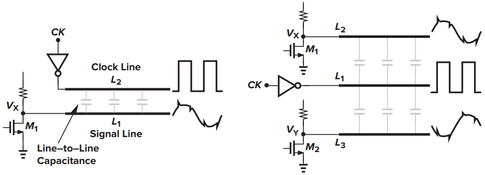
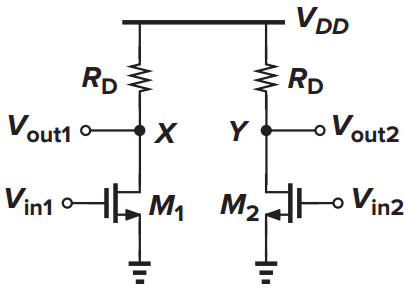
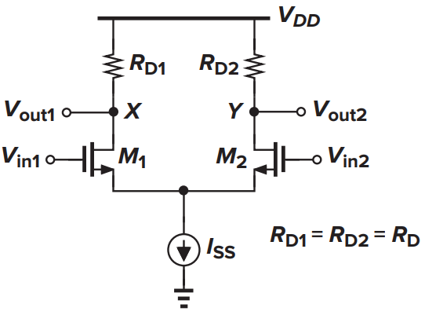
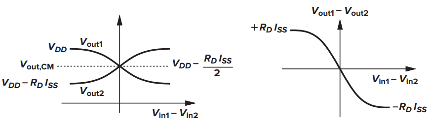
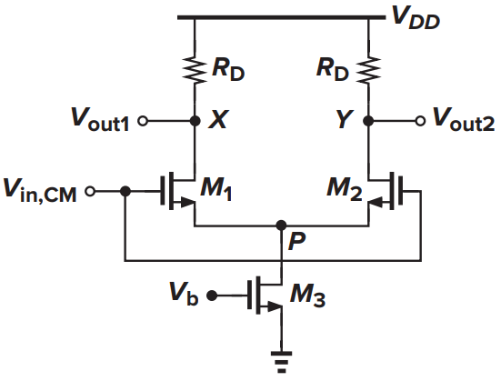
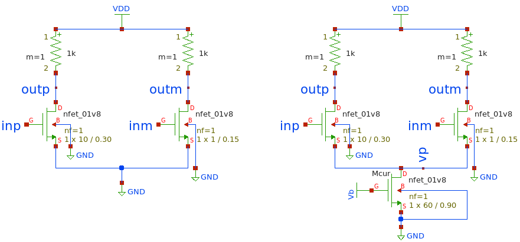
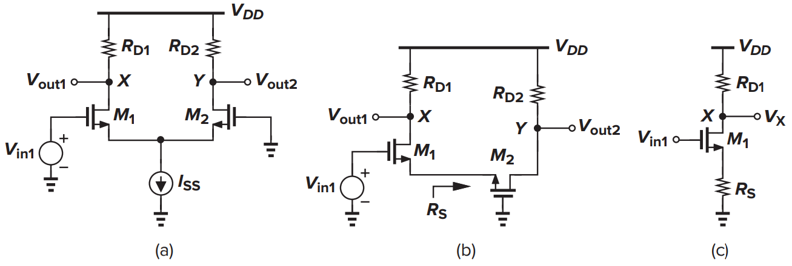
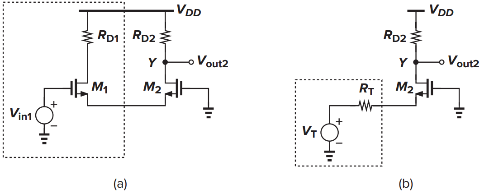

```{r  include=FALSE}
library(plotly)
library(ggplot2)
library(dplyr)
library(purrr)
```

# Դիֆերենցիալ ուժեղարարար։

Դիֆերենցիալ ուժեղարաը առաջին անգամ հանդես է եկել վակումաին լամպերով
իրականացված։ Միկրոէլեկտրոնիկաի զարգացման արագությունը հաշվի առնելով
կարելի է ասել որ դա շատ վաղ անցիալում էր։ Սակայն Դիֆերենցիալ տոպոլոգիան
միշտ կարևորագույն դեր է ունեցել և անբաժանելի մաս է հանդիսանում
ժամանակակից էլեկտրոնիկայում։ Նախքան ուժեղարարների հատկությունների
ուսումնասիրումը անհրաժեշտ է իմանալ թե ինչ է դիֆերենցիալ ազդանշանը ուստի
այդտեղից էլ կսկսենք։

## դիֆերենցիալ ազդանշան։

Ընդհանրապես ազդանշան ասելով մենք հասկանում ենք լարման կամ հոսանքի
փոփոխություն որոնք ստացվում են տարբեր աղբյուրներից։ իտարբերություն «մեկ
հաղորդալարով» փոխանցվող ազդանշանի որի արժեքը չափում ենք ֆիքսված
մակարդակի նկատմամբ «ազդանշանի և մակարդակի տարբերությունը» դիֆերենցիալ
ազդանշանը հաղորդվում է երկու հաղորդալարով և չափվում է դրանց
տարբերությամբ։ Ըստ էության դրանք նույն ամպլիտուդով սակայն հակառակ
փուլերով մեծություններ են առանձին վերցրած որոնք տատանվում են ընդհանուր
մակարդակի շուրջ «common-mode»։ ազդանշանի այսպիսի ձևափոխման հիմնական
նպատակը այն է որ ավելի աղմուկակայուն է։

```{r, echo=FALSE, out.width='100%', fig.align='center', fig.cap='...'}

```

Եթե ստեղծում ենք այն պայմանը որ երկու հաղորդալալերի վրա պառազիտիկ
էֆեքտները\
հավասար չափով են գումարվում «թողնում են նույն ազդեցությունը» ինչպես
պատկերված է նկ (3.1)-ոմ ընդունման կետում երբ չափում ենք ազդանշանը երկու
հաղորդալալերի պոտենցիալների տարբերությունը ստացվում է ճանապարին ավելացած
աղմուքները առանց ջանքերի դուրս են գալիս։

## դիֆերենցիալ զույգ։

Դիֆերենցիալ ազդանշանի ուժեղացման համար այն ինչ կարող ենք առաջարկել ընկած
է նախորդ բաժնում կատարած դիտարկումների հիման վրա։ Ըստ էության անհրաժեշտ
է երկու միանման ուժեղարարներ զույգ ազդանշանները առանձին ուժեղացնելու
համար։

::: {.cols data-latex=""}
::: {.col data-latex="{0.2\\textwidth}"}
Նկարում պատկերված է դիֆերենցիալ զույգ։ Երկու դիֆերենցիալ մուտքերը՝
$V_{in1}$ և $V_{in2}$ , որոնք ունեն որոշակի ընդանուր մակարդակ՝ միացված
են ՄՕԿ֊երի փականներին։\
երկու ելքերը տատանվում են ելքային ընդհանուր պոտենցիալի շուրջ և միասին
կազմում են դիֆերենցիալ ազդանշան։
:::

::: {.col data-latex="{0.1\\textwidth}"}
  <!-- an empty Div (with a white space), serving as
a column separator -->
:::

::: {.col data-latex="{0.7\\textwidth}"}
```{r, echo=FALSE, out.width="1000px", fig.align='center', fig.cap='...'}

```
:::
:::

Սխեման հանդիսանում է դիֆերենցիալ ուժեղարար սակայն ունի մի շատ կարևոր
թերություն։ Ինչ տեղի կունենա երբ մութքային ընդհանուր մակարդակը տատանվի։
Կախված փոփոխության չափից հնարաոր է ՄՕԿ֊երը դուրս գան հագեցման ռեժիմից,
կամ փականի պոսենցիալը չգերազանցի շեմաին լարումը։ Նշված երկու սահմանաին
դեպքերի միջև ընկած հատվածում ելքային ընդհանու մակարդակը կարծես հետևում է
մութքային մակարդակի փոփոխությանը։ Կարող ենք արդյոք ձևափոխել այնպես որ
ստանանք կայուն ուժեղացում և ֆիքսված ելքային ընդհանուր մակարդակ։ Պարզվում
է այո։

::: {.cols data-latex=""}
::: {.col data-latex="{0.2\\textwidth}"}
Նկարում պատկերված է առաջին լավարկումը ըստ որի երկու ճուղերով անցնող
հոսանքի գումարը միշտ մնում է նույնը $I_{D1} + I_{D2} = I_{SS}$, իսկ երբ
$V_{in1} = V_{in2}$ Նշված սահմանաին միջակայքում անկախ մութքային
ընդհանուր պոտենցիալի արժեքից ելքի ընդանուր պոտենցիալը կլինի
$V_{DD} - R_{D} I_{SS}/2$
:::

::: {.col data-latex="{0.1\\textwidth}"}
  <!-- an empty Div (with a white space), serving as
a column separator -->
:::

::: {.col data-latex="{0.7\\textwidth}"}
```{r, echo=FALSE, out.width="1400px", fig.align='center', fig.cap='...'}

```
:::
:::

Նախքան արդեն մեզ հայտնի հետազոտությունների շարքը սկսելը օգտակար է իմանալ
թե ինչ է տեղի ունենում շղթայում։ Դիցուկ $V_{in1} − V_{in2}$֊ը փոփոխվում
է $−∞$-ից մինչև $+∞$: Եթե $V_{in1}$-ը շատ ավելի բացասական է, քան
$V_{in2}$-ը, $M1$-ը փակ կլինի, $M2$-ը բացված, հետևաբար $I_{D2} = ISS$։
Այսպիսով, $V_{out1} = V_{DD}$, $V_{out2} = V_{DD} - R_{D} I_{SS}$:
Ենթադրենք $V_{in1}$֊ը մոտենում է $V_{in2}$֊ին $M1$-ը աստիճանաբար բացվում
է որշակի հոսանք սկսում է անցնել առաջին ճուղով հետևաբար $V_{out1}$֊ը
սկսում է փոքրանալ քանի որ $I_{D1} + I_{D2} = I_{SS}$ երկրորդ ճուղով
անցնող հոսանքը սկսում է փոքրանալ իսկ $V_{out2}$֊ը մեծանալ։ երբ
$V_{in1} = V_{in2}$֊ին երկու ճուղերով անցնում է նույն $I_{SS}/2$ հոսանքը
հետևաբար ելքերը հավասարվում են իրար
$V_{out1} = V_{out2}=V_{DD} - R_{D} I_{SS}/2$ որը **ելքային ընդանուր
մակարդակն «CM»** է։ այս կետը հանդիսանում է համաչապության կետ
$V_{in1} − V_{in2}$ հետագա մեծացումը բերում է նրան որ իվերջո ամբողջ
$I_{SS}$ հոսանքը անցնում է առաջին ճուղով։

```{r, echo=FALSE, out.width="100%", fig.align='center', fig.cap='...'}

```

Վերլուծությունը բացահայտում է դիֆերենցիալ զույգի երկու կարևոր հատկանիշ:

-   Մեծագույն և փոքրագույն ելքի արժեքները համապատասխանաբար $V_{DD}$ և
    ${V_{DD} - R_{D} I_{SS}}$ է ընդ որում այն կախված չէ մութքային
    ընդհանուր մակարդակից։
-   փոքր ազդանշանի ամենամեծ ուժեղացումը $V_{in1} = V_{in2}$ կետում է
    տեղի ունենում։ «Հետագայում խիստ կապացուցենք» այժմ կարող ենք ասել որ
    $V_{in1} - V_{in2}$֊ի որոշակի միջակայքից դուրս ուժեզացման գործակիցը
    հավասարվում է $0$֊ի։

::: {.cols data-latex=""}
::: {.col data-latex="{0.2\\textwidth}"}
Որպիսի պարզենք արդյոք հոսանքի աղբյուր ավելացնելով ճնշում ենք մութքի
ընդհանուր մակարդակի տատանումների դերը ելքի ընդանուր մակարդակի վրա
կազմենք «Spice» նկարագրություն որտեղ $V_{in1} = V_{in2}$ միացված են
իրար, որպես հոսանքի աղբյուր միացնենք ՄՕԿ տրանզիստոր։ Հետազոտենք արդյոք
մութքային ընդհանու մակարդակի կամայական արժեքի դեպքում ելքի ընդհանու
մակարդակը նույնն է։ Հետազոտության համար բավական է մութքի լարումը փոփոխել
և գրանցել արձյունքները։
:::

::: {.col data-latex="{0.1\\textwidth}"}
  <!-- an empty Div (with a white space), serving as
a column separator -->
:::

::: {.col data-latex="{0.7\\textwidth}"}
```{r, echo=FALSE, out.width="1400px", fig.align='center', fig.cap='...'}

```
:::
:::

```{r  echo=FALSE, warning = FALSE,  fig.cap='...', out.width='100%', fig.align='center'}
df <- read.csv('./sp_data/difamp_1.csv')
df$Vgs <- df$Vin - df$Vsors
df$Vds <- df$Vout-df$Vsors
unicVb <- unique(df$Vbias)

pal <- c("green", "blue4", "magenta", "red", "goldenrod", "darkorange")
pal <- setNames(pal, unique(df$Vbias))
m <- list(
  l = 50,
  r = 50,
  b = 100,
  t = 100,
  pad = 4
)

fig1 <- plot_ly(df, color =  ~Vbias, colors = pal , legendgroup = ~Vbias )
fig2 <- plot_ly(df, color =  ~Vbias, colors = pal , legendgroup = ~Vbias, showlegend = F )
fig3 <- plot_ly(df, color =  ~Vbias, colors = pal , legendgroup = ~Vbias,  showlegend = F)

fig1 <- fig1%>% layout(autosize = F, height = 1000,
                       title = "ելքի ընդհանուր մակարդակի կախումը մուտքի ընդհանուր մակարդակից։", 
                       legend=list(title=list(text='Vb:')),
                       xaxis = list( 
                                    title = 'Մութքի ընդհանուր մակարդակը։'
                                    ), 
                       yaxis = list( 
                                     title = 'Ելքի ընդհանուր մակարդակը։'
                                    )
                      )

fig2 <- fig2%>% layout(autosize = F, height = 1000,
                       title = "Հոսանքի կախումը մուտքի ընդհանուր մակարդակից։",   
                       xaxis = list( 
                                    title = 'Մութքի ընդհանուր մակարդակը։'
                                   ), 
                       yaxis = list( 
                                    title = 'շղթայով անցնող հոսանքը։'
                                   )
                      )
fig3 <- fig3%>% layout(autosize = F, height = 1000,
                       title = "P հանգույցի լարման կախումը մուտքի ընդհանուր մակարդակից։", 
                       xaxis = list( 
                                    title = 'Մութքի ընդհանուր մակարդակը։'
                                   ), 
                       yaxis = list( 
                                    title = 'P հանգույցի լարումը։'
                                   )
                      )

for(i in unicVb){
  fig1 <- fig1 %>% add_trace(data = df[df$Vbias == i,], x = ~Vin,  y = ~Vout, 
                             type = 'scatter', mode = 'lines',
                             name = i,
                             customdata = ~ map2(Vgs, Vds, list),
                             hovertemplate = paste('<br><b>Vout</b>:%{y:.3f}<br>', 
                                                   '<i>Vgs</i>: %{customdata[0]:.2f}</br>',
                                                   '<i>Vds</i>: %{customdata[1]:.2f}</br>',
                                                   '<i>Vin</i>: %{x}')
                             ) 
  fig2 <- fig2 %>% add_trace(data = df[df$Vbias == i,], x = ~Vin,  y = ~ -current, 
                             type = 'scatter', mode = 'lines',
                             name = i,
                             customdata = ~ map2(Vgs, Vds, list),
                             hovertemplate = paste('<br><b>Current</b>:%{y:.3f}<br>', 
                                                   '<i>Vgs</i>: %{customdata[0]:.2f}</br>',
                                                   '<i>Vds</i>: %{customdata[1]:.2f}</br>',
                                                   '<i>Vin</i>: %{x}')
                             ) 
  fig3 <- fig3 %>% add_trace(data = df[df$Vbias == i,], x = ~Vin,  y = ~Vsors, 
                             type = 'scatter', mode = 'lines',
                             name = i,
                             customdata = ~ map2(Vgs, Vds, list),
                             hovertemplate = paste('<br><b>Vsorse</b>:%{y:.3f}<br>', 
                                                   '<i>Vgs</i>: %{customdata[0]:.2f}</br>',
                                                   '<i>Vds</i>: %{customdata[1]:.2f}</br>',
                                                   '<i>Vin</i>: %{x}')
                             ) 
}


fig <- subplot( fig1, fig2, fig3, nrows = 3,  margin = 0.05, shareX = T, titleY = FALSE, titleX = FALSE)

annotations = list( 
  list( 
    x = 0.5,  
    y = 0.33,  
    text = "Մութքի ընդհանուր մակարդակը։",  
    xref = "paper",  
    yref = "paper",  
    xanchor = "center",  
    yanchor = "bottom",  
    showarrow = FALSE 
  ),  
  list( 
    x = 0.5,  
    y = 0.66,  
    text = "Մութքի ընդհանուր մակարդակը։",  
    xref = "paper",  
    yref = "paper",  
    xanchor = "center",  
    yanchor = "bottom",  
    showarrow = FALSE 
  ),
 list( 
    x = 0.5,  
    y = 0,  
    text = "Մութքի ընդհանուր մակարդակը։",  
    xref = "paper",  
    yref = "paper",  
    xanchor = "center",  
    yanchor = "bottom",  
    showarrow = FALSE 
  ))
fig <- fig %>%layout(annotations = annotations) 
fig
##titleY = FALSE, titleX = FALSE,
  
```

```{r  echo=FALSE, warning = FALSE,  fig.cap='...', out.width='100%', fig.align='center'}
fig <- plot_ly(df, x= ~ Vin, y= ~Vgs, color =  ~Vbias, 
               type = 'scatter', mode = 'line',colors = pal , legendgroup = ~Vbias )
fig <- fig%>% add_trace(x= ~Vin , y= ~Vds, type = 'scatter', mode = 'line')

fig
```


Գրաֆիկները ստացվել են «Spice» հետազոտության արդյունքում տարբեր $V_b$֊ի
համար։ Ինչպես ցույց է տրված գրաֆիկներում քանի դեռ մութքի լարումը փոքր է
$M_{1}$ և $M_{2}$֊ի շեմային լարումից շղթայով հոսանք չի անցնի հետևաբար
ելքերը հավասար են սնման լարմանը, $P$ կետում լարումը 0 է ուստի $M_{3}$֊ը
գտնվում է խորը գծաին ռեժիմում։ Երբ մուտքի ընդանուր մակարդակը աստիճանաբար
բարձրանում է սկսում է գերազանցել $M_{1}$ և $M_{2}$֊ի շեմային լարումը
շղթայով սկսում է հոսանք անցնել որը բերում է նրան որ $P$ հանգույցի
պոտենցիալը աստիճանաբար բարձրանում է։ $P$֊ի այն փոքրագույն արժեքը որից
հետո $M_{3}$֊ը դուրս է գալիս գծային ռեժիմից $V_{b}- V_{TH3}$ է։ Դիցուկ
դա տեղի է ունենում $V_{GS} = V_{in}- V_{P}$ արժեքի դեպքում։ Հետևաբար
շղթաի կոռեկտ աշխատանքի համար անհրաժեշտ է որ մուտքի ընդհանու մակարդակը
$V_{in , CM} ≥ V_{GS} + V_{b} - V_{TH3}$:

Ի՞նչ կլինի, եթե \$V\_{in} շարունակենք մեծացնել։ Որպիսի $M_{1}$֊ը և
$M_{2}$֊ը մնան հագեցման ռեժիմում անհրաժեշտ է
$V_{out1,out2} > V_{in} - V_{TH}$: Ընդունենք որ երբ $M_{3}$-ը հագեցման
ռեժիմում է $I_{SS} ≈ Const$ նշանակում է
$V_{out} = V_{DD} - R_{D} I_{SS}/2$: Հետևաբար մութքային ընդհանու
մակարդակը ունի սահմանափակում նաև վերևից
$V_{in , CM} ≤ V_{DD} - R_{D} I_{SS}/2 + V_{TH}$:

Ուսուցողական է նաև ժամանակաին հետազոտությունը։ Որպես այդպիսին նույն դիֆերենցիալ ազդանշանին 
գումարենք աղմուքներ ստացված ազդանշանը կիրառենք երկու նույն դիֆերենցիալ զույգին միայն այն 
տարբերությամբ որ առաջին դեպքում բացակայում է հոսանքի աղբյուրը իսկ երկրորդ դեպքում որպոս 
հոսանքի աղբյուր միացված է ՆՄՕԿ տրանզիստոր։ Ինչպես պատկերված է նկարում։

```{r, echo=FALSE, out.width="100%", fig.align='center', fig.cap='...'}

```
Դիֆերենցիալ ազդանշանները առանձին վերցրած ունեն գրաֆիկում պատկերված տեսքը՝

```{r  echo=FALSE, warning = FALSE,  fig.cap='...', out.width='100%', fig.align='center'}
df <- read.csv('./sp_data/difpar.csv')

fig1 <- plot_ly(df , x = ~time,  y = ~inp, type = 'scatter', 
                mode = 'lines', name = "INPLUS:",
                hovertemplate = paste('<br><b>inp</b>:%{y:.3f}<br>', 
                                      '<i>time</i>: %{x:.3f}')
                )


fig2 <- plot_ly(df , x = ~time,  y = ~inm, type = 'scatter',
                mode = 'lines', name = "INMINUS",
                hovertemplate = paste('<br><b>inm</b>:%{y:.3f}<br>', 
                                      '<i>time</i>: %{x:.3f}')
                )


fig1 <- fig1%>% layout(autosize = T)

fig2 <- fig2%>% layout(autosize = T)


fig <- subplot( fig1, fig2,  nrows = 2,  margin = 0.05, shareX = T, titleY = FALSE, titleX = FALSE)

fig <- fig %>%layout(title = "Դիֆերենցիալ ազդանշանները") 
fig
  
```
Որքան էլ ազդանշանները առանձին վերցրած բարդ տեսք ունեն բավական է չափել դրանց մեջ 
պոտենցիալների տարբերությունը և կտեսնենք ներդաշնակ տատանում։


```{r  echo=FALSE, warning = FALSE,  fig.cap='...', out.width='100%', fig.align='center'}
fig <- plot_ly(df , x = ~time,  y = ~(inp - inm), type = 'scatter', 
              mode = 'lines',
              hovertemplate = paste('<br><b>in</b>:%{y:.3f}<br>', 
                                      '<i>time</i>: %{x:.3f}')
              )

fig <- fig%>% layout(autosize = T,
                       title = "Դիֆերանցիալ ազդանշանների տարբերությունը"
                      )

fig
  
```
Այժմ պատկերենք ելքերի տարբերությունը առաջին սխեմաի համար։

```{r  echo=FALSE, warning = FALSE,  fig.cap='...', out.width='100%', fig.align='center'}

fig1 <- plot_ly(df , x = ~time,  y = ~(outp - outm), type = 'scatter',
              mode = 'lines',
              hovertemplate = paste('<br><b>out</b>:%{y:.3f}<br>', 
                                      '<i>time</i>: %{x:.3f}')
              
              )

fig1 <- fig1%>% layout(autosize = T,
                       title = "Դիֆերանցիալ զույգի ելքը։"
                      )

fig2 <- plot_ly(df , x = ~time,  y = ~(ip + im), type = 'scatter',
              mode = 'lines',
              hovertemplate = paste('<br><b>out</b>:%{y:.3f}<br>', 
                                      '<i>time</i>: %{x:.3f}')
              
              )

fig2 <- fig2%>% layout(autosize = T,
                       title = "Դիֆերանցիալ զույգի ելքը։"
                      )
fig <- subplot( fig1, fig2,  nrows = 2,   heights = c(0.7, 0.3), shareX = T)

fig
  
```

Ինչպես նշված էր վերևում **դիֆերենցիալ** մուտքը և ելքը այդքան էլ իրար նման չէն։ 
ՈՒժեղարարին այդքան էլ չի հաջողվել մուտքի ընդհանուր մակարդակի փոփոխությանը չարձագանքել։


```{r  echo=FALSE, warning = FALSE,  fig.cap='...', out.width='100%', fig.align='center'}

df <- read.csv('./sp_data/difamp_2.csv')

fig1 <- plot_ly(df , x = ~time,  y = ~(outp - outm), type = 'scatter',
               mode = 'lines',
              hovertemplate = paste('<br><b>out</b>:%{y:.3f}<br>', 
                                      '<i>time</i>: %{x:.3f}')
              
              )

fig1 <- fig1%>% layout(autosize = T,
                       title = "Դիֆերանցիալ զույգի ելքը։"
                      )

fig2 <- plot_ly(df , x = ~time,  y = ~(ip + im), type = 'scatter',
              mode = 'lines',
              hovertemplate = paste('<br><b>out</b>:%{y:.3f}<br>', 
                                      '<i>time</i>: %{x:.3f}')
              
              )

fig2 <- fig2%>% layout(autosize = T,
                       title = "Դիֆերանցիալ զույգի ելքը։"
                      )
fig <- subplot( fig1, fig2,  nrows = 2,  heights = c(0.7, 0.3),  shareX = T)

fig
  
```
Ինչպես տեսնում ենք երբ միացված է հոսանքի աղբյուր էական տարբերվում է ելքը։ Այո շղթայով 
անցնող հոսանքը այդքան էլ հաստատուն չէ և արձագանքում է արագ փոփոխություններին  սակայն 
պետք է ուշադրություն դարձնել 

Նշնեք որ եթե աղմուքները գումարվել են նախքան ազդանշանը դիֆերենցիալ դարձնելը ապա 
ուժեղացումից հետո պետք չէ ակնկալել որ աղմուքի մակարդակը կճնշվի։

## Մեծ ազդանշանային վարքագիծ

Դիտարկենք նկ․ 3.3-ում ներկայացված դիֆերենցիալ զույգը: Մեր նպատակն է
որոշել $V_{out1} - V_{out2}$ և $V_{in1} - V_{in2}$֊ի միջև կապը: Հայտնի է
որ՝ $V_{out1} = V_{DD} − R_{D1} I_{D1}$ և
$V_{out2} = V_{DD} − R_{D2} I_{D2}$ հետևաբար
$V_{out1} - V_{out2} = R_{D1} I_{D1} - R_{D2} I_{D2}$ եթե
$R_{D1} = R_{D2} = R_{D}$՝
$V_{out1} - V_{out2} = R_{D}(I_{D1} - I_{D2})$։ Այսպիսով խնդիրը կարող
ենք համարել լուծված եթե գտնենք $I_{D1} - I_{D2}$֊ի և $V_{in1} - V_{in2}$֊ի միջև կապը։
ենթադրենք $M_{1}$-ը և $M_{2}$-ը հագեցած են, և $λ = 0$: Քանի որ $P$
հանգույցում լարումը մի կողմից հավասար է $V_{in1} - V_{GS1}$ միուս կողմից
$V_{in2} - V_{GS2}$ կարող ենք գրել՝

```{=tex}
\begin{equation} 
V_{in1} - V_{in2} = V_{GS1} - V_{GS2}։
  (\#eq:1)
\end{equation}
```
ՄՕԿ֊ի ՎԱԲ֊ից հայտնի է որ՝

```{=tex}
\begin{equation} 
V_{GS} = \sqrt{\frac{2 I_{D}}{ μ_n C_{ox} \frac{W}{L}}} - V_{TH}։
  (\#eq:2)
\end{equation}
```
(3.1) և (3.2)֊ից կունենանք՝

```{=tex}
\begin{equation} 
V_{in1} - V_{in2} = \sqrt{\frac{2 I_{D1}}{ μ_n C_{ox} \frac{W}{L}}} - \sqrt{\frac{2 I_{D2}}{ μ_n C_{ox} \frac{W}{L}}} ։
  (\#eq:3)
\end{equation}
```
(3.3) արտահայտության երկու կողմը բարձրացնենք քառակուսի հաշվի առնելով որ
$I_{D1} + I_{D2} = I_{SS}$ կունենանք՝

```{=tex}
\begin{equation} 
(V_{in1} - V_{in2})^2 = \frac{2}{ μ_n C_{ox} \frac{W}{L}} (I_{SS} - 2 \sqrt{I_{D1} I_{D2}}) \\
2 \sqrt{I_{D1} I_{D2}} = I_{SS} - \frac{1}{2} μ_n C_{ox} \frac{W}{L} (V_{in1} - V_{in2})^2
  (\#eq:4)
\end{equation}
```
(3.4)֊ը երկու մասը կրկին բարցրացնենք քառակուսի հաշվի առնելով որ՝
$4I_{D1} I_{D2} = (I_{D1}+I_{D2})^2 - (I_{D1} - I_{D2})^2 = I_{SS}^2 - (I_{D1} - I_{D2})^2$
կունենանք՝

```{=tex}
\begin{equation} 
(I_{D1} - I_{D2})^2 = - \frac{1}{4} (μ_n C_{ox} \frac{W}{L})^2 (V_{in1} - V_{in2})^4 + I_{SS}  μ_n C_{ox} \frac{W}{L}(V_{in1} - V_{in2})^2
  (\#eq:5)
\end{equation}
```
```{=tex}
\begin{equation} 
I_{D1} - I_{D2}= \frac{1}{2} μ_n C_{ox} \frac{W}{L} (V_{in1} - V_{in2}) \sqrt{\frac{4 I_{SS}} { μ_n C_{ox} \frac{W}{L} } - (V_{in1} - V_{in2})^2 } \\
 = \sqrt{μ_n C_{ox} \frac{W}{L} I_{SS}} (V_{in1} - V_{in2}) \sqrt{1- \frac{μ_n C_{ox} W/L}{4 I_{SS}} (V_{in1} - V_{in2})^2}
  (\#eq:6)
\end{equation}
```
$M_{1}$ , $M_{2}$ , $M_{3}$֊ը միասին գործում են որպես
$V_{in1} - V_{in2}$ լարումով ղեկավարվող $I_{D1} - I_{D2}$ հոսանքի
աղբյուր ընդ որում երբ $V_{in1} - V_{in2} =0$֊ի $I_{D1} - I_{D2} = 0$:
$|V_{in1} - V_{in2}|$ աճին զուգահեռ աճում է նաև $|I_{D1} - I_{D2}|$֊ը։
Նախքան ստացված արտահայտության հետագա ուսումնասիրությունը, հաշվենք
$M_{1}$-ի և $M_{2}$-ի համարժեք $G_m$: Նշ․
$\Delta V_{in} = V_{in1} - V_{in2}$ և $\Delta I_{D} = I_{D1} - I_{D2}$

```{=tex}
\begin{equation} 
\frac{\partial \Delta I_{D}}{\partial \Delta V_{in}} = 
\frac{1}{2} μ_n C_{ox} \frac{W}{L} \frac{ \frac{4 I_{SS}}{μ_n C_{ox} W/L} - 2 \Delta V_{in}^2}
{\sqrt{\frac{4 I_{SS}}{μ_n C_{ox} W/L} - \Delta V_{in}^2}}
  (\#eq:7)
\end{equation}
```
Հեշտ է համոզվել որ $G_{m}$֊ը ընդունում է իր առավելագույն արժեքը երբ
$\Delta V_{in} = 0$: Փոքր ազդանշանի ուժեղացման գործակցի համար «ընդհանուր
մակարդակի շուրջ փոքր ամպլիտուդով փոփոխվող ազդանշան» կարող ենք գրել՝

```{=tex}
\begin{equation} 
|A_{v}| = \sqrt{μ_n C_{ox} \frac{W}{L} I_{SS}} R_{D}
  (\#eq:8)
\end{equation}
```
(3.8)֊ը կարելի է գրել նաև $|A_{v}| = g_{m}R_D$: Այս ձևափոխությունը
ստացվում է այն դեպքում երբ $\Delta V_{in} \to 0$ որի արդյունքում երկու
ճուղերով անցնում է $I_{SS}/2$ հոսանքը։

(3.7)֊ում $G_{m}$֊ը հավասարվում է 0֊ի երբ
$\Delta V_{in} = \sqrt{2 \frac {2 I_{SS}}{μ_n C_{ox} W/L}}$:

Այժմ ավելի մանրամասն քննենք (3.6) հավասարումը: Եթե 
${(V_{in1} - V_{in2})^2 \ll \frac {4I_{SS}}{μ_n C_{ox} W/L}}$ այն կարող
ենք գրել՝

```{=tex}
\begin{equation} 
I_{D1} - I_{D2} = \sqrt{μ_n C_{ox} \frac{W}{L} I_{SS}} (V_{in1} - V_{in2})
  (\#eq:9)
\end{equation}
```
(3.9)֊ը նույնությամբ կրկնում է (3.6)֊ի դիֆերենցումից ստացված
հավասարությունը։ $|V_{in1} - V_{in2}|$֊ի մեծացումը բերում է
$|I_{D1} - I_{D2}|$֊ի մեծացմանը։ Սակայն
$\Delta V_{in} = \sqrt{\frac{4 I_{SS}}{μ_n C_{ox} W/L}}$ արժեքում
$\Delta I_{D}$֊ը պետք է հավասարվի 0֊ի որը իրականում տեղի չի ունենում։
Պետճառն այն է որ բոլոր հավասարությունները ստացվել են ենթադրելով որ
$M_{1}$֊ը և $M_{2}$֊ը ոչ միայն բաց են այլ նաև երկուսն էլ հագեցման
ռեժիմում են։ իրականում $| \Delta V_{in} |$ մեծացումը կբերի նրան որ
ամբողջ $I_{SS}$ հոսանքը կանցնի մի ճուղով։

## Փոքր֊ազդանշանի վերլուծություն։

$\Delta V_{out}$֊ի և $\Delta V_{in}$֊ի միջև կապը ստացվեց ենթադրելով որ ՄՕԿ֊երը գտնվոմ են 
հագեցման ռեժիմում, իսկ $\Delta V_{in}$֊ը ընդանուր մակարդակի շուրջ տատանվող երկու փոքր 
ամպլիտուդով մեծություններ են արցյունքում ստացվեց 
$\Delta V_{out} = g_{m} R_{D} \Delta V_{in}$:
նույն արձյունքը կարաղ ենք ստանալ նաև կազմելով  փոքր ազդանշան մոդել։ Դա կանենք երկու 
տարբեր եղանակներով։

**Եղանակ 1**

```{r, echo=FALSE, out.width="100%", fig.align='center', fig.cap='...'}

```
այս եղանակով երկու մուտքերը դիտարկում ենք որպես առանձին ազդանշաններ և օգտվում ենք 
վերադրման սկզբունքից։ Ըստ վերադրման սկզբունքի շղթաի արձագանքը հավասար առանձին 
ազդեցությունների արձագանքների գումարին։ Այսպիսով $V_{in2}$֊ը կարող ենք ներկայացնել 
որպես հաստատուն ընդհանուր մակարդակի և փոփոխական մասերի գումար։  
գտնենք $V_{in1}$֊ի արձագանքը $X$ և $Y$ կետերում երբ $V_{in2}$֊ը միայն հաստատուն մասն է։ 
Փոքր֊ազդանշանի մոդելը ներկայացված է նկ․ (3.13) ում։ այսպիսի միացումը մեզ արդեն հայտնի 
ընդհանուր ակունքով ուժեղարարին, որի ակունքը միացված է դիմադրությամբ «$M_{2}$֊ն համարժոք 
դիմադրությունը»։ Եթե անտեսում ենք հոսքուղու մոդուլացիան և հարթակ էֆեկտը $M_{2}$֊ին համարժեք 
դիմադրությանը կլինի $R_{S} = \frac{1}{g_{m2}}$: 

```{=tex}
\begin{equation} 
\frac{V_{X}}{V_{in}} = \frac{- R_{D}}{\frac{1}{g_{m1}} + \frac{1}{g_{m2}}}
  (\#eq:10)
\end{equation}
```
```{r, echo=FALSE, out.width="100%", fig.align='center', fig.cap='...'}

```

$V_{Y}$֊ը հաշվելու համար ինչպես ցույց է տրված նկարում $M_{2}$֊ը  
համարվում է ակունքի հետևորդ, ակոիմքին միացված է $M_{1}$֊ը որը պետք է փոխարինենք 
Տվինենի համարժեքին։ 


VY-ը հաշվարկելու համար մենք նշում ենք, որ M1-ը մղում է M2-ին որպես
աղբյուրի հետևորդ և փոխարինում Vin1-ը և M1-ը Thevenin-ով: համարժեք (նկ.
4.18). Թեվենինի լարումը VT = Vin1 և դիմադրությունը RT = 1/gm1: Այստեղ
գործում է M2-ը որպես ընդհանուր դարպասի փուլ, ցուցադրելով շահույթ, որը
հավասար է
