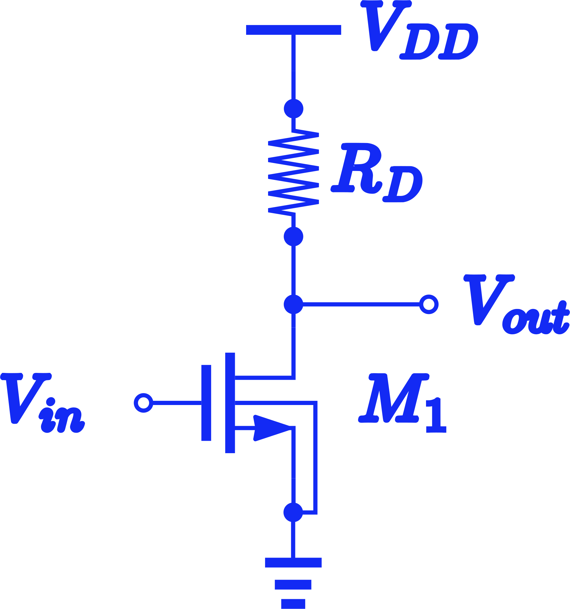
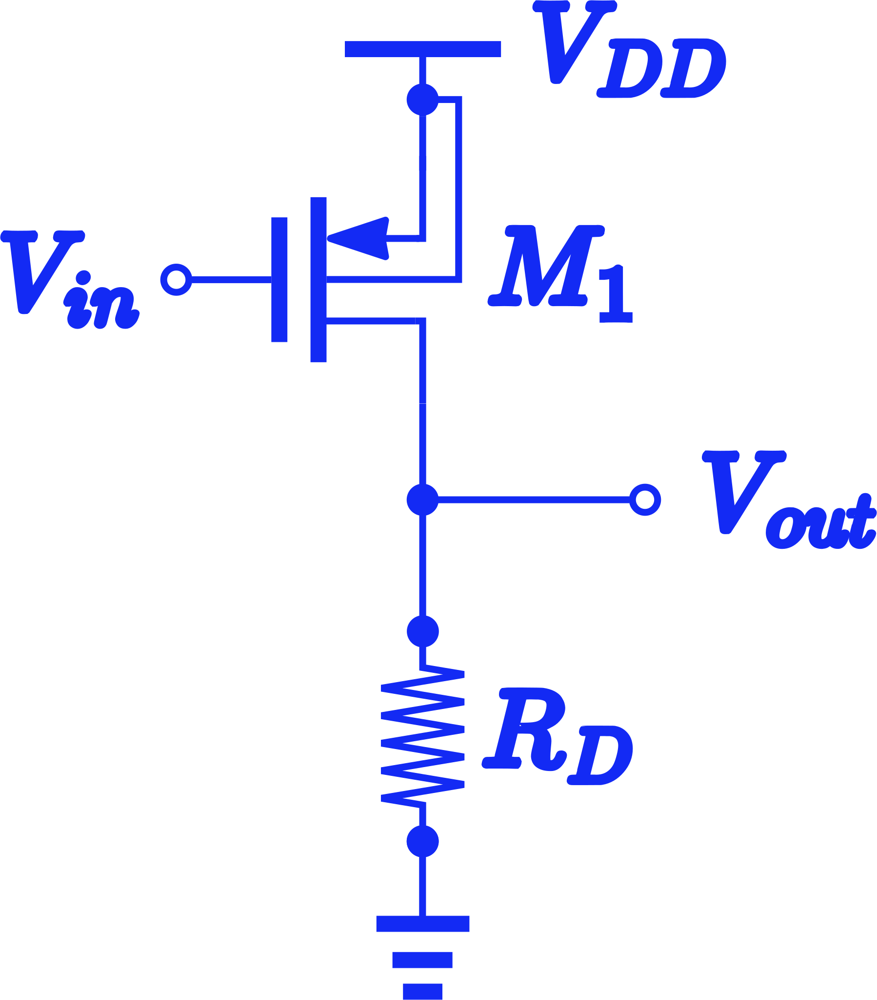

```{r setup, include=FALSE}
library(ggplot2)
library(plotly)
library(flexdashboard)

```

# ՆՄՕԿ

## Column {.tabset data-width="400"}

### SPICE նկարագրությունը։

```         

.lib /usr/local/share/pdk/sky130A/libs.tech/ngspice/sky130.lib.spice tt
.GLOBAL GND 

XM1 out in GND GND sky130_fd_pr__nfet_01v8 L=0.15 W='5 * 1 ' nf=1
Rd vdd out 1k m=1

Vin in GND 1.8
Vdd vdd GND 1.8

.control
.save deriv(V(out))
.save V(in)
.save V(out)
.save I(Vdd)

dc Vin 0 1.8 0.005  Rd 500 3500 500

write filename.raw
.endc
.end


```

### Սխեման։



## Column {data-width="600"}

### Ելքի լարման և ուժեղացման գործակցի կախումը մուտքի լարումից։

```{r}
df <- read.csv(url("https://raw.githubusercontent.com/Varlusin/analog_design/master/sp_data/cs_dc_nf.csv"))
pal <- c("green", "blue", "magenta", "red", "goldenrod", "darkorange", "purple4") 
pal <- setNames(pal, unique(df$rez))
l <- list(
  title=list(text='$R_{dr}$'),
  font = list(
    family = "sans-serif",
    size = 10,
    color = "#3ADAC6"),
  bgcolor = "#101010",
  bordercolor = "#101010",
  arker_size=20,
  borderwidth = 2, orientation = 'h')

fig1 <- plot_ly()%>%
  add_trace(data = df , x = ~Vin, y= ~Vout , color = ~rez,
            type ='scatter',  mode = 'lines', text = ~ rez,
            hovertemplate = paste('<br><b>Vout</b>:%{y:.3f}<br>', 
                                  '<i>Vin</i>: %{x}'), 
            colors = pal,
            line = list( width = 3), legendgroup = ~rez
            )%>%
  
  add_trace(x= ~c(0.98 ,1.5), y= ~c(0.48, 1),
            type ='scatter',  mode = 'lines',
            name = 'Vout = Vin - Vth',
            line = list(color = 'rgb(128, 128, 128)', width = 2, dash = 'dot'))%>%
  
  layout(
          legend=l,
          plot_bgcolor = "rgba(0,0,0,0)",
          paper_bgcolor = "rgba(0,0,0,0)"

        )

fig2 <- plot_ly()%>%
  add_trace(data = df , x = ~Vin, 
            y= ~gain , color = ~rez,
            type ='scatter',  mode = 'lines',  text = ~ rez,
            hovertemplate = paste('<br><b>Gain</b>:%{y:.3f}<br>',  
                                  '<i>Vin</i>: %{x}'), 
            colors = pal, showlegend = F,
            line = list( width = 3), legendgroup = ~rez)%>%
  layout( plot_bgcolor = "rgba(0,0,0,0)",
          paper_bgcolor = "rgba(0,0,0,0)")

fig <- subplot( fig1, fig2, nrows = 2, margin = 0,  shareX = T, titleY = FALSE, titleX = FALSE)%>%
layout(margin=list(l=0, r=0, t=0, b=0) , paper_bgcolor="rgba(0,0,0,0)")
fig
```

# ՊՄՕԿ

## Column {.tabset data-width="400"}

### SPICE նկարագրությունը։


```
.lib /usr/local/share/pdk/sky130A/libs.tech/ngspice/sky130.lib.spice tt
.GLOBAL GND 

XM1 out in vdd vdd sky130_fd_pr__pfet_01v8 L=0.15 W='5 * 1 ' nf=1
Rd  out GND 1k m=1

Vin in GND 1.8
Vdd vdd GND 1.8

.control
.save deriv(V(out))
.save V(in)
.save V(out)
.save I(Vdd)

dc Vin 0 1.8 0.005  Rd 500 3500 500

write filename.raw
.endc
.end

```

### Սխեման։



## Column {data-width="600"}

### Ելքի լարման և ուժեղացման գործակցի կախումը մուտքի լարումից։

```{r}
df <- read.csv(url("https://raw.githubusercontent.com/Varlusin/analog_design/master/sp_data/cs_dc_pf.csv"))
pal <- c("green", "blue", "magenta", "red", "goldenrod", "darkorange", "purple4") 
pal <- setNames(pal, unique(df$rez))
l <- list(
  title=list(text='$R_{dr}$'),
  font = list(
    family = "sans-serif",
    size = 10,
    color = "#3ADAC6"),
  bgcolor = "#101010",
  bordercolor = "#101010",
  arker_size=20,
  borderwidth = 2, orientation = 'h')

fig1 <- plot_ly()%>%
  add_trace(data = df , x = ~Vin, y= ~Vout , color = ~rez,
            type ='scatter',  mode = 'lines', text = ~ rez,
            hovertemplate = paste('<br><b>Vout</b>:%{y:.3f}<br>', 
                                  '<i>Vin</i>: %{x}'), 
            colors = pal,
            line = list( width = 3), legendgroup = ~rez
            )%>%
  
  add_trace(x= ~c(0.52 ,0), y= ~c(1.02, 0.5),
            type ='scatter',  mode = 'lines',
            name = 'Vout = Vin - Vth',
            line = list(color = 'rgb(128, 128, 128)', width = 2, dash = 'dot'))%>%
  
  layout(
          legend=l,
          plot_bgcolor = "rgba(0,0,0,0)",
          paper_bgcolor = "rgba(0,0,0,0)"

        )

fig2 <- plot_ly()%>%
  add_trace(data = df , x = ~Vin, 
            y= ~gain , color = ~rez,
            type ='scatter',  mode = 'lines',  text = ~ rez,
            hovertemplate = paste('<br><b>Gain</b>:%{y:.3f}<br>',  
                                  '<i>Vin</i>: %{x}'), 
            colors = pal, showlegend = F,
            line = list( width = 3), legendgroup = ~rez)%>%
  layout( plot_bgcolor = "rgba(0,0,0,0)",
          paper_bgcolor = "rgba(0,0,0,0)")

fig <- subplot( fig1, fig2, nrows = 2, margin = 0,  shareX = T, titleY = FALSE, titleX = FALSE)%>%
layout(margin=list(l=0, r=0, t=0, b=0) , paper_bgcolor="rgba(0,0,0,0)")
fig


```
