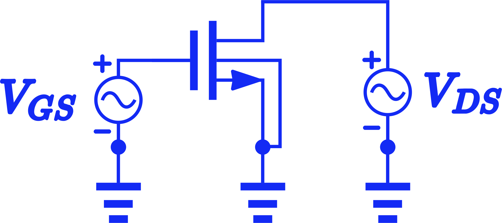
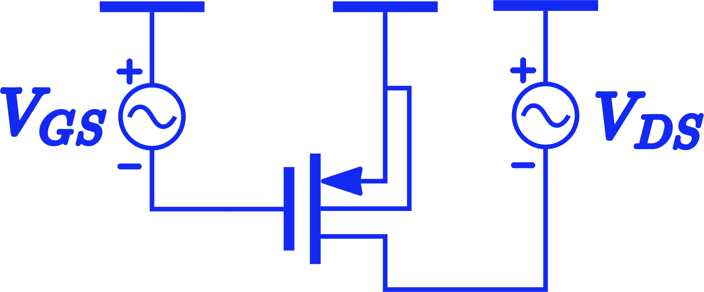

```{r setup, include=FALSE}
library(ggplot2)
library(plotly)
library(plyr)
library(flexdashboard)

```

```{r include=FALSE}
accumulate_by <- function(dat, var) {
  var <- lazyeval::f_eval(var, dat)
  lvls <- plotly:::getLevels(var)
  dats <- lapply(seq_along(lvls), function(x) {
    cbind(dat[var %in% lvls[seq(1, x)], ], frame = lvls[[x]])
  })
  dplyr::bind_rows(dats)
}
```

# ՆՄՕԿ

## Column {data-width="600"}

### ՎԱԲ֊Ը 3D ՊԱՏԿԵՐՄԱՄԲ

```{r}
df <- read.csv(url('https://raw.githubusercontent.com/Varlusin/analog_design/master/sp_data//nvab3d.csv'))

df<-df[2: 62]
Vds <- seq(from = 0, to = 1.8, by = 0.03)
Vgs<- seq(0, 1.8, 0.03)
I <- data.matrix(df, rownames.force = NA)


fig <- plot_ly(
  x = ~Vgs,
  y = ~Vds,
  z = ~I)%>% add_surface() %>%
  layout( plot_bgcolor = "rgba(0,0,0,0)",
          paper_bgcolor = "rgba(0,0,0,0)")
fig

```

## Column {data-width="400"}

### Ըմբիչի հոսանքը փական֊ակունք տարբեր լարումների համար։

```{r}
df <- read.csv(url("https://raw.githubusercontent.com/Varlusin/analog_design/master/sp_data//vabnmos.csv"))
df <- df[c('vin', 'Vds', 'Iddrane', 'Idgate')]
df$vin <- (round(df$vin*1000, digits = 0))/1000
vec <- seq(from = 0, to = 1.8, by = 0.02)
df<-subset(df, vin %in% vec)
df <- df %>% accumulate_by(~vin)


pal <- c( "red", "blue","orange", "green",  "magenta")
pal <- setNames(pal, unique(df$Vds))

fig <- df %>%plot_ly( x = ~vin,  y = ~ -Iddrane, split = ~Vds, 
                      frame = ~frame, type = 'scatter', mode = 'lines', 
                      line = list(simplyfy = F), colors = pal
  )

fig <- fig %>% layout(legend=list(title=list(text='Vgs', x = 1, y = 0.5)),
  xaxis = list(
    title = 'ԸՄԲԻՉ ԱԿՈՒՆՔ ԼԱՐՈՒՄԸ։',
    zeroline = F
  ),
  yaxis = list(
    title = 'ԸՄԲԻՉԻ ՀՈՍԱՆՔԸ։',
    zeroline = F
  ),
  plot_bgcolor = "rgba(0,0,0,0)",
  paper_bgcolor = "rgba(0,0,0,0)"
) 
fig <- fig %>% animation_opts(
  frame = 100, 
  transition = 0, 
  redraw = FALSE
)
fig <- fig %>% animation_slider(
  hide = T
)
fig <- fig %>% animation_button(
  x = 1, xanchor = "right", y = 0, yanchor = "bottom"
)

fig

```

### Ըմբիչի հոսանքը ըմբիչ֊ակունք տարբեր լարումների համար։

```{r}
rm(fig)
fig <- df %>%plot_ly( x = ~vin,  y = ~ -Idgate, split = ~Vds, 
                      frame = ~frame, type = 'scatter', mode = 'lines', 
                      line = list(simplyfy = F), colors = pal
  )

fig <- fig %>% layout(legend=list(title=list(text='Vds', x = 1, y = 0.5)),
  xaxis = list(
    title = 'ԸՄԲԻՉ ՓԱԿԱՆ ԼԱՐՈՒՄԸ։',
    zeroline = F
  ),
  yaxis = list(
    title = 'ԸՄԲԻՉԻ ՀՈՍԱՆՔԸ։',
    zeroline = F
  ),
  plot_bgcolor = "rgba(0,0,0,0)",
  paper_bgcolor = "rgba(0,0,0,0)"
) 
fig <- fig %>% animation_opts(
  frame = 100, 
  transition = 0, 
  redraw = FALSE
)
fig <- fig %>% animation_slider(
  hide = T
)
fig <- fig %>% animation_button(
  x = 1, xanchor = "right", y = 0, yanchor = "bottom"
)

fig
```

# ՊՄՕԿ

## Column {data-width="600"}

### ՎԱԲ֊Ը 3D ՊԱՏԿԵՐՄԱՄԲ

```{r}
df <- read.csv(url('https://raw.githubusercontent.com/Varlusin/analog_design/master/sp_data//pvab3d.csv'))

df<-df[2: 62]
Vds <- seq(from = 0, to = 1.8, by = 0.03)
Vgs<- seq(0, 1.8, 0.03)
I <- data.matrix(df, rownames.force = NA)


fig <- plot_ly(
  x = ~Vgs,
  y = ~Vds,
  z = ~I)%>% add_surface()%>%
  layout( plot_bgcolor = "rgba(0,0,0,0)",
          paper_bgcolor = "rgba(0,0,0,0)")

fig
```

## Column {data-width="400"}

### Ըմբիչի հոսանքը փական֊ակունք տարբեր լարումների համար։

```{r}
rm(fig)
df <- read.csv(url("https://raw.githubusercontent.com/Varlusin/analog_design/master/sp_data//vabpmos.csv"))
df <- df[c('vin', 'Vds', 'Iddrane', 'Idgate')]
df$vin <- (round(df$vin*1000, digits = 0))/1000
vec <- seq(from = 0, to = 1.8, by = 0.02)
df<-subset(df, vin %in% vec)
df <- df %>% accumulate_by(~vin)


pal <- c( "red", "blue","orange", "green",  "magenta")
pal <- setNames(pal, unique(df$Vds))

fig <- df %>%plot_ly( x = ~vin,  y = ~ -Iddrane, split = ~Vds, 
                      frame = ~frame, type = 'scatter', mode = 'lines', 
                      line = list(simplyfy = F), colors = pal
  )

fig <- fig %>% layout(legend=list(title=list(text='Vgs', x = 1, y = 0.5)),
  xaxis = list(
    title = 'ԸՄԲԻՉ ԱԿՈՒՆՔ ԼԱՐՈՒՄԸ։',
    zeroline = F
  ),
  yaxis = list(
    title = 'ԸՄԲԻՉԻ ՀՈՍԱՆՔԸ։',
    zeroline = F
  ),
  plot_bgcolor = "rgba(0,0,0,0)",
  paper_bgcolor = "rgba(0,0,0,0)"
) 
fig <- fig %>% animation_opts(
  frame = 100, 
  transition = 0, 
  redraw = FALSE
)
fig <- fig %>% animation_slider(
  hide = T
)
fig <- fig %>% animation_button(
  x = 1, xanchor = "right", y = 0, yanchor = "bottom"
)

fig
```

### Ըմբիչի հոսանքը ըմբիչ֊ակունք տարբեր լարումների համար։

```{r}
rm(fig)
fig <- df %>%plot_ly( x = ~vin,  y = ~ -Idgate, split = ~Vds, 
                      frame = ~frame, type = 'scatter', mode = 'lines', 
                      line = list(simplyfy = F), colors = pal
  )

fig <- fig %>% layout(legend=list(title=list(text='Vds', x = 1, y = 0.5)),
  xaxis = list(
    title = 'ԸՄԲԻՉ ՓԱԿԱՆ ԼԱՐՈՒՄԸ։',
    zeroline = F
  ),
  yaxis = list(
    title = 'ԸՄԲԻՉԻ ՀՈՍԱՆՔԸ։',
    zeroline = F
  ),
  plot_bgcolor = "rgba(0,0,0,0)",
  paper_bgcolor = "rgba(0,0,0,0)"
) 
fig <- fig %>% animation_opts(
  frame = 100, 
  transition = 0, 
  redraw = FALSE
)
fig <- fig %>% animation_slider(
  hide = T
)
fig <- fig %>% animation_button(
  x = 1, xanchor = "right", y = 0, yanchor = "bottom"
)

fig
```

# SPICE NETLIST

## Column {.tabset}

### ՆՄՕԿ SPICE նկարագրությունը։

```         
.lib /usr/local/share/pdk/sky130A/libs.tech/ngspice/sky130.lib.spice tt
.GLOBAL GND

XM1 d g GND GND sky130_fd_pr__nfet_01v8 L=0.15 W=1 nf=1 

Vds d GND 1.8
Vgs g GND 1.8

.save V(g)
.save V(d)
.save I(Vds)

.control
dc Vgs 0 1.8 0.03 Vds 0 1.8 0.03
write filename.raw
.endc
.end
```
### Սխեման։



## Column {.tabset}

### ՊՄՕԿ SPICE նկարագրությունը։

```         
.lib /usr/local/share/pdk/sky130A/libs.tech/ngspice/sky130.lib.spice tt
.GLOBAL GND

XM1 d g vdd vdd sky130_fd_pr__pfet_01v8 L=0.15 W=1 nf=1 

Vvdd vdd GND 1.8
Vds d GND 1.8
Vgs g GND 1.8

.save V(g)
.save V(d)
.save I(Vds)

.control
dc Vgs 0 1.8 0.03 Vds 0 1.8 0.03
write filename.raw
.endc
.end
```
### Սխեման։

