# ՆԱԽԱԲԱՆ {-}

Մենք ինքներս այս ոլորտում սկսնակ ենք և սովորելու ընթացքում միտք առաջացավ ստեղծել այս գրվածքը որտեղ շատ համառոտ ներկայացված են անալոգային ինտեգրալ սխեմաների նախագծման հիմունքները։ Աշխատանքը գտնվում է մշակման փուլում։ Կոդերը և աշխատանքում կատարված «Spice» հետազոտության արձյունքները «csv» ձևաչափով տեղադրված են [Github](https://github.com/Varlusin/analog_design.git){target="_blank"} հղումում, որոնցից ընթերցողը կարող է օգտվել տարբեր նպատակներով։ Հիմնական գրականությունը որից օգտվել ենք [Behzad Razavi](https://en.wikipedia.org/wiki/Behzad_Razavi){target="_blank"}֊ի **Design of Analog CMOS Integrated Circuits** է։ Ինչպես նաև հատուկ շնորհակալություն ենք հայտնում [Synopsys Armenia](https://www.synopsys.com/company/contact-synopsys/office-locations/armenia.html){target="_blank"} ուսումնական բաժնի դասախոսներին։ Աշխատանքում շեշտը դրված է սխեմաների «Spice» մոդելաորման և արձյունքների վիզուալիզացման վրա։

# ԸՆԴՀԱՆՈՒՐ ԷԼԵԿՏՐԱՏԵԽՆԻԿԱ 

## ՊԱՏՄԱԿԱՆ ԱԿՆԱՐԿ

Դեռևս հին ժամանակներում մարդկանց հայտնի է եղել որ նյութը կազմված է փոքրագույն մասնիկներից։ Հին Հույներին հայտնի էր որ Սաթը իրեն է ձգում փոքր մարմիններ երբ այն շփում են մորթիով։ 1700-ական թվականի սկզբին ֆրանսիացի քիմիկոս [Շառլ Ֆրանսուա դյու Ֆեյը](https://en.wikipedia.org/wiki/Charles_Fran%C3%A7ois_de_Cisternay_du_Fay){target="_blank"} պարզեց, որ լիցքավորված ոսկու թիթեղը և մետաքսով շփած ապակին միմիանց վանում են, իսկ նույն թիթեղը ձգվում է բուրդով շփված սաթը: Այս և նմանատիպ այլ փորձերից դյու Ֆայը եզրակացրեց, որ գոյություն ունեն երկու տեսակի էլեկտրական մասնիկներ։ 18-րդ դարի վերջում [Ջոն Դալտոնը](https://en.wikipedia.org/wiki/John_Dalton){target="_blank"} նկատել էր որ նյութերը քիմիական ռեակցիաի մեջ են մտնում մասերով և այդ մասնիկներին անվանեց ատոմ որպես անբաժանելի մասնիկ։ Սակայն այդ ժամանակաշրջանում մի շարք անվանի գիտնականներ կատարել էին տարբեր տեսակի փորձնական աշխատանքներ: 1904 թվականին [Ջ. Ջ. Թոմսոնը](https://en.wikipedia.org/wiki/J._J._Thomson){target="_blank"} առաջարկեց ատոմի մոդել ըստ որի ատոմները կազմված են դրական լիցքավորված գնդից, որի մեջ ներկառուցված են բացասական լիցքավորված էլեկտրոններ, ինչպես «սալորը» (էլեկտրոնները) «թխվածքի» (դրական լիցքի) մեջ։

:::{.img-text-box}
:::{.imige-left }
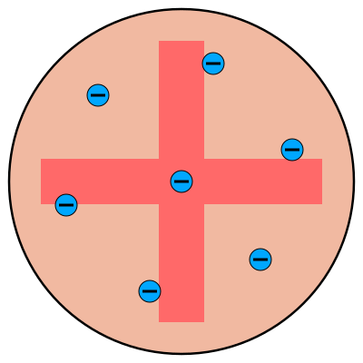
<p class="caption">Նկ․ (1.1)։</p>
:::
:::{.text-box}
Նկարում պատկերված է Թոմսոնի ատոմի մոդելը։ Այս մոդելը հաճախ կոչվում է «plum pudding model» կամ «չամիչով բուլկի մոդել»: Թոմսոնի մոդելի հիմնական հատկանիշներից մեկը այն էր որ, ընդհանուր ատոմը էլեկտրաչեզոք է: Դրական և բացասական լիցքերի խառնուրդը բաշխված են ամբողջ ատոմում, ընդ որում ընդհանուր լիցքը հավասար է 0֊ի:
:::
:::

:::{.img-text-box}
:::{.imige-left }
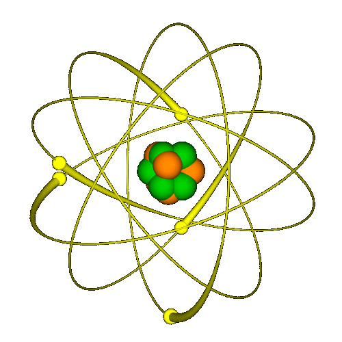
<p class="caption">Նկ․ (1.2)։</p>
:::
:::{.text-box}
1911 թվականին [Ռեզերֆորդը](https://en.wikipedia.org/wiki/Ernest_Rutherford){target="_blank"}  հերքեց Թոմսոնի մոդելը իր հայտնի ոսկե փայլաթիթեղի փորձով։ Ռադիոակտիվ տարրի ճառագայթած ալֆա մասնիկները ուղղելով դեպի ոսկու բարակ թիթեղը շատ անսպասելի նկատվեցին մասնիկներ որոնք չապազանց շատ են շեղվել սկզբնական շարժման ուղղությունից իսկ մի քանիսը նույնիսկ հետ են վերադարձել։ Նկատված երևույթը լիովին հերքեց Թոմսոնի մոդելը քանի որ շարժման ուղղության նման մեծ փոփոխությունը կարող էր տեղի ունենալ միայն այն դեպքում երբ ալֆա մասնիկները բախվեին կենտրոնացված դրական լիցքի հետ որը պետք է ունենար մեծ զանգված։ Արդյունքում առաջարկվեց ատոմի նոր մոդել ըստ որի այն կազմված է դրական լիցքաորված խիտ միջուկից, որի շուրջ պտտվում են էլեկտրոնները։ Այն շատ նման էր արեգակնային համակարգին միայն գրավիտացիայի փոխարեն գործում է էլեկտրաստատիկ ուժը։
:::
:::

1913-թվականին [Նիլս Բորը](https://en.wikipedia.org/wiki/Niels_Bohr){target="_blank"} ընդլայնեց Ռեզերֆորդի ատոմի մոդելը և առաջարկեց սեփական մոդելը որտեղ պահպանվեց ծանր դրական միջուկը բայց էլեկտրոնները կարող էին ունենալ միայն դիսկրետ որոշակի ուղղեծրեր, որոնցից յուրաքանչյուրին համապատասխանում է էներգիաի որոշակի մակարդակ։ էլեկտրոնը կարող էր մի ուղղեծրից անցնել միուսը կլանելով կամ ճառագայթելով էներգիա։

Նշենք որ այս մոդելները միանգամից չնդունվեց քանի որ ակնհայտ հակասում էին դասական ֆիզիկային մասնաորապես այն որ պտտվող էլեկտրոնը պետք է ճառագայթեր էլ․մագնիսական ալիք, որի արդյունքում կորցներ ունեցած կինետիկ էներգիան։ Արդյունքում 19-րդ դարը ռեվոլուցիոն դարձավ ֆիզիկայի համար։ Այդ ժամանակաշրջանում ծնունդ առավ քվանտային ֆիզիկան։

## ԷԼԵԿՏՐԱԿԱՆ ԴԱՇՏ

:::{.img-text-box}
:::{.imige-left }
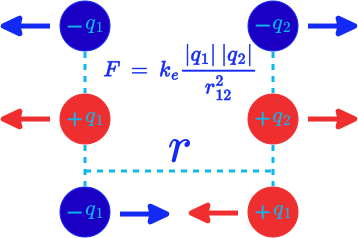
<p class="caption">Նկ․ (1.3)։</p>
:::
:::{.text-box}
Ըստ Կուլոնի օրենքի երկու անշարժ կետային լիցքերի (երբ սեփական չափերը կարելի է անտեսել) փոխազդեցության ուժը վակուումում ուղիղ համեմատական ​​է լիցքերի բացարձակ արժեքների արտադրյալին և հակադարձ համեմատական նրանց միջև հեռավորության քառակուսուն: երկու լիցքերի փոխազդեցության ուժը միշտ ընկած է այդ լիցքակիրների կենտրոնները իրար միացնող գծի երկայնքով՝ մոդուլով իրար հավասար են ուղղությամբ հակառակ ընդ որում նույն անուն լիցքերը իրար վանում են իսկ տարանունները ձգում։ 
:::
:::
Դժվար չէ եզրակացնել որ լիցքակիր մասնիկը իր շուրջը ստեղծում է մի այնպիսի հատկություն որ ուրիշ լիցքակիր մասնիկի վրա ազդում է ուժ։ Ահա այդ հատկությունը, կոչվում է էլեկտրական դաշտ: Նշենք դաշտի հատկանիշներից՝

**ա)** էլեկտրական դաշտը մատերիայի գոյության որոշակի ձև է,

**բ)** էլեկտրական դաշտը օժդված է էներգիայով 

**գ)** էլեկտրական դաշտի համար ճիշտ է վերադրման օրենքը։


:::{.img-text-box}
:::{.imige-left }
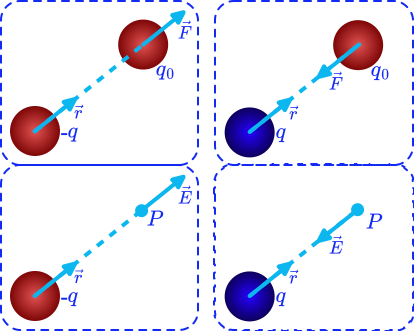
<p class="caption">Նկ․ (1.4)։</p>
:::
:::{.text-box}
Էլեկտրական դաշտը քանակապես բնութագրում է դաշտի լարվածության վեկտորական մեծությունը, որը որոշակի $P(x,y,z)$ կետում հավասար է միաոր դրական կետային լիցքի վրա ազդող ուժին։  Քննարկենք վակուումում $q_0$ կետային լիցք որը գտնվում է $q$ լիցքի ստեղծած էլ․դաշտում։$q$ $q_0$ լիցքերի կենտրոնները միացնող վեկտորը նշանակենք $\vec{r}$  դաշտի լարվածության վեկտորը կլինի՝   
:::
:::

```{=tex}
\begin{equation} 
  \vec{E} = \frac{\vec{F}}{q_0} =\frac{1}{4 \pi Ɛ_0} \frac{q}{r^3} \vec{r}:
  (\#eq:1)
\end{equation}
```

Դիցուկ ունենք $N$ թվով $q_1, \: q_2, \: q_3, \: \cdots, \: q_n$ լիցքեր որոնցից յուրաքանչյուրը ստեղծում է դաշտ։ Որևէ $P$ կետում $q_0$ լիցքի վրա այդ $N$ թվով լիցքերի թողած ազդեցությունը հավասար է դրանց առանձին ազդեցությունների գումարին։ Այստեղից էլ կարելի է պնդել որ լիցքերի ստեղծած համազոր դաշտի լարվածության վեկտորը հավասար է առանձին վերցված դաշտերի լարվածությունների գումարին $\vec{E} \: = \:\vec{E_1} \:+\:\vec{E_2}\:\cdots\:+\:\vec{E_n}$։ 

Էլեկտրական դաշտը գրաֆիկորեն պատկերվում է ուժագծերի օգնությամբ։ դաշտի որևէ կետում լիցքավորված մասնիկի վրա ազդող ուժի վեկտորը ընկած է այդ կետում ուժագծին տարված շոշափողի երկայնքով։ Դաշտի լարվածության ուղղությունը նշելու համար ուժագծերին տրվում է ուղղություն՝ որը ունի դրական լիցքի վրա ազդող ուժի ուղղությունը, իսկ մեծությունը բնութագրվում է ուժագծերի խտությամբ։

:::{.imige-center-100 }
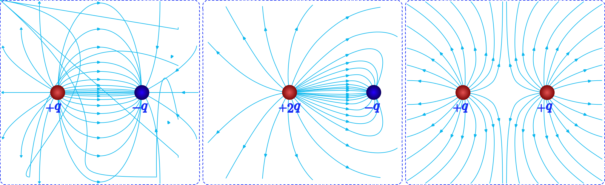
<p class="caption">Նկ․ (1.5)։</p>
:::

:::{.img-text-box}
:::{.imige-left }
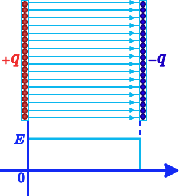
<p class="caption">Նկ․ (1.6)։</p>
:::
:::{.text-box}
Դիտարկենք երկու զուգահեռ հարթություններ որոնք հավասարաչափ լիցքաորված են նույն քանաքի տարբեր նշանի լիցքով։ հարթությունների ներսում ընկած տարածության ցանկացած կետում դաշտի լարվածության վեկտորը ուղղված է դրական լիցքաորված հարթությունից դեպի բացասական լիցքաորված հարթությունը։ Վերադրելով հարթությունների դաշտերը 

:::
:::


## ՕՀՄԻ ՕՐԵՆՔԸ

Ըստ Օհմի օրենքի հաղորդալարի որևէ տեղամասով անցնող հոսանքի ուժը ուղիղ համեմատական է այդ տեղամասում պոտենցիալների տարբերությանը` $U = IR$ որտեղ $R$֊ը հաղորդալարի դիմադրությունն է։ Այս օրենքը փորձնական ճահապարով էմպիրիկ տվյալների հիման վրա է ստացվել։ 

:::{.img-text-box}
:::{.imige-left }
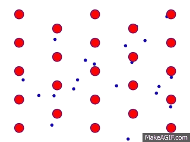
<p class="caption">Նկ․ (1.3)։</p>
:::
:::{.text-box}
Հետագայում **հաղորդիչների** համար կառուցվեց ազատ էլեկտրոնների մոդելը որը լավագույնս է բացատրում էլ․հաղորդականությունը։ Մոդելում էլեկտրոնները դիտարկվում է որպես իդեալական գազ  որի սեփական չափերը անտեսվում է։ Ինչպես նաև համարվում է որ դրանք միմիանց հետ չէն փոխազդում։ համակարգը գտնվում է ջերմային հավասարակշռության մեջ կատարելով քաոսային շարժում։ Փոխազդեցության բացակայության պայմանը հիմնաորվում է նրանով որ եթե էլեկտրոնները միմիանց վանում են ապա ատոմի միջուկը ձգում է էլեկտրոնին։ Բնականաբար շարժման ընթացքում տեղի են ունենում __«բախումներ»__ բյուրեղական ցանցի իոնների հետ որի արդյունքում էլեկտրոնների և արագությունը և շարժման ուղղությունը փոփոխվում է։ Նշանակում է փոփոխվում է նաև կինետիկ էներգիան։ Սակայն ջերմային հավասարակշռության պայմանը նշանակում է որ էլեկտրոնային գազի և իոնների ջերմաստիճանները պետք է հավասար լինեն հետևաբար միջինում էլեկտրոնային գազից փոխանցված էներգիան պետք է հավասար լինի իոնների փոխանցած էներգիային։ Քաոսային շարժումը ենթադրում է որ ժամանակի ընթացքում էլեկտրոնի կատարած տեղափոխության վեկտորը 0 է։ Քանի որ գազում բոլոր էլեկտրոնները գտնվում են հավասար պայմաններում նշանակում է այս ենթադրությունը վերաբերվում է բոլոր էլեկտրոններին։ Ջերմային շարժումը չի կարող մետաղում առաջացնել էլ․հոսանք։ Էլ․ հոսանքի համար անհրաժեշտ է արտաքին ազդեցություն որը էլեկտրոններին կդնի ուղղորդված շարժման մեջ օր․ արտաքին էլ դաշտ, ջերմաստիճանների տարբերություն, անհավասարաչափ լուսաորություն, և այլն։ 
Այժմ ենթադրենք մետաղում ստեղծում ենք արտաքին էլ․ դաշտ։ էլեկտրոնները կսկսեն շարժվել դաշտի լարվածության վեկտորի հակառակ ուղղությամբ միարժամանակ միուս ուղղություններով շարունակելով քաոսային շարժումը։ Արտաքին դաշտի ազդեցությամբ շարժումը կոչվում է դրեյֆային շարժում։ Կլասիկ տեսությունում ենթադրվում է որ էլեկտրոնի և բյուրեղական ցանցի միջև տեղի է ունենում մեխանիկական բախում երկու իրար հաջորդող բախումների ընթացքում էլեկտրոնը համարվում է «ազատ» մասնիկ։ Շարժումը բնութագրելու համար մտցնում ենք երկու ֆիզիկական մեծություններ $τ$ ժամանակը և $l$ ճանապարհը։ $τ$֊ն միջինացված մեծություն է և ցույց է տալիս ազատ ընթացքի տևողությունը իսկ $l$֊ը միջինում անցած ճանապարհը։ $l = v_{T} \tau$ որտեղ $v_{T}$֊ն միջին արագությունն է։ Ենթադրվում է որ ջերմային արագությունը շատ մեծ է դրեյֆի շարժումից ինչպես նաև բախման արդյունքում դաշտից ստացված ամբողջ էներգիան հաղորդվում է բյուրեղային ցանցի իոններին։ Այլ կերպ ասած բախումից հետո էլեկտրոնները շարժվում են պատահական ուղղությամբ։ Երկու բախումների ընթացքում դրեյֆային շարժման միջին արագությունը կլինի՝
:::
:::

```{=tex}
\begin{equation} 
  v_{d} = \frac{e \tau}{2 m} E:
  (\#eq:1)
\end{equation}
```
Նշանակենք $μ = \frac{e \tau}{2 m}$: $μ$֊ն կապ է հաստատում դաշտի լարվածության և դրեյֆի միջին արագության միջև և կոչվում է էլեկտրոնի շարժողունակություն։ Եթե էլեկտրոնների կոնցենտրացիան $n$֊է ապա միաոր ժամանակում միաոր մակերես ունեցող լայնական հատույթով անցնող հոսանքը՝ «հոսանքի խտությունը» կլինի՝

```{=tex}
\begin{equation} 
  j = e n v_{d} = e n μ E = \sigma E:
  (\#eq:2)
\end{equation}
```
[1.2]֊ը Օհմի օրենքն է դիֆերենցիալ տեսքով։ Որտեղ $\sigma$֊ն մետաղի հաղորդականություն է։

```{=tex}
\begin{equation} 
  \sigma = \frac{e^2 n \tau}{2m}:
  (\#eq:3)
\end{equation}
```
[1.3] արտահայտությունը առաջինը ստացվել է [Պաուլ դրուդեի](https://en.wikipedia.org/wiki/Paul_Drude){target="_blank"} կողմից։ Նշենք որ այն ճիշտ է այնքան ժամանակ քանի դեռ դաշտի լարվածությունը չի փոխել էլեկտրոնների կոնցենտրացիան կամ շարժողականությունը։ Շատ հեշտ կարելի է ցույց տալ որ էլ․հաղորդականությանը ֆունկցիա է ջերմաստիճանից։ Քանի որ ջերմաստիճանի բարձրացումը բերում է $\tau$ ժամանակի փոքրացման։ Հաղորդիչների համար այդ կախումը տրվում է ավելի հայտնի՝

```{=tex}
\begin{equation} 
  R(t) = R_0(1+\alpha t ):
  (\#eq:4)
\end{equation}
```
որտեղ $R_0$֊ն $t=0^o C$ ում դիմադրությունն է։


##  ԿԻՍԱՀԱՂՈՐԴԻՉՆԵՐԻ ԷԼ․ՀԱՂՈՐԴԱԿԱՆՈՒԹՅԱՆ ՄՈԴԵԼԸ։ 

Պարզվում է տարբեր նյութեր ունեն տարբեր հաղորդականություն։ Ըստ հաղորդականության նյութերը բաժանվում են **երեք** խմբի՝ հաղորդիչներ, կիսահաղորդիչներ և դիէլեկտրիկներ։ Հաճախ հանդիպում է սահմանում որտեղ ասվում է կիսահաղորդիչները այն նյութերն են որոնց հաղորդականությունը՝ $\sigma ≈ [10^{-8} : 10^{6}] Սիմ \cdot մ^{-1}$ միջակաըքում է։ համաձայնվեք նման սահմանումը ոչինչ չի ասում նյութի ներսում տեղի ունեցող երևույթների դրա առանձնահատկությունների մասին։ Հետաքրքրաշարժ առանձնահատկություններից մեկը էլ․հաղորդականության կախումն է ջերմաստիճանից։ Տարբեր փորձեր ավարտվել են այն ելքով որ կիսահաղորդիչների դիմադրությունը արագ նվազում է ջերմաստիճանի բարձրացմանը զուգնթաց։ Որոշակի ջերմաստիճանի տիրույթում դիմադրության և ջերմաստիճանի միջև կապը տրվում է՝ 

```{=tex}
\begin{equation} 
  R(T) = R_0 e^{\frac{B}{T}}:
  (\#eq:5)
\end{equation}
```
Որտեղ $R_0$֊ն և $B$֊ն որոշ հաստատուններ են ջերմաստիճանի այդ միջակայքում տվյալ նյութի համար։ [1.5]֊ը կարող ենք ներկայացնել՝ 

```{=tex}
\begin{equation} 
  \sigma = \sigma_0 e^{-\frac{B}{T}} = \sigma_0 e^{-\frac{E_a}{kT}}:
  (\#eq:6)
\end{equation}
```
տեսքով։ Որտեղ $E_a = kB$, $k$֊ն Բոլցմանի հաստատունն է։

Նշանակում է կիսահաղորդիչը՝ նյութ է որի էլ․հաղորդականությունը սենիակային ջերմաստիճանում $[10^{-8} : 10^{6}] Սիմ \cdot մ^{-1}$ միջակայքում է, իսկ ջերմաստիճանից կախված է էքսպոնենցիալ օրենքով։

Նյութում ատոմների փոխազդեցության հետևանքով առաջանում է բյուրեղային ցանց, որի հատկությունները որոշվում է ատոմի շուրջ առաջացած էլէկտրոնային թաղանտը։ Հիմնական դեր է խաղում այսպես կոչված փոխանակման էֆեկտը, ըստ որի ատոմները կարող են միմիանց տալ էլեկտրոններ։  


<!--  այստեղ անհրաժեշտ է ավելացնել նոռմալ նյութ վալենտականության կովալենտ կապի մասին -->

Կրեմնի օրինակով ուսումնասիրենք կիսահաղորդիչների էլ․հաղորդականությունը։ Կրեմնի ատոմը ունի 14 էլեկտրոն: Ինչպես հայտնի է դպրոցական քիմիաի դասընթացից յուրաքանչյուր էլէկտրոնային թաղանթ (մակարդակ) կարող է պարունակել առավելագույնը $2 \cdot n^2$ քանակությամբ էլեկտրոն՝ որտեղ $n$-ը մակարդակի համարն է:  որոնք ըստ ուղղեծրի բաշխված են ${(1s^{2})(2s^{2})(2p^{6})(3s^{2})(3p^{2})}$։ Ներքին էլեկտրոնային թաղանտը ամբողջությամբ զբաղված չէ այն պարունակում է 2 s և 2 p վիճակի էլեկտրոններ։ Բյուրեղական ցանցի առաջացումից յուրաքանչյուր ատոմի չորս վալենտ էլեկտրոնները ${3s^{2}3p^{2}}$ վիճակից անցնում են հիբրիդային ${sp^{3}}$ վիճակի առաջացնելով չորս կովալենտ կապ։ Արդյունքում յուրաքանչյուր ատոմ գտնվում է չորս հարևան ատոմների կենտրոնում։ 

:::{.imige-center-100 }
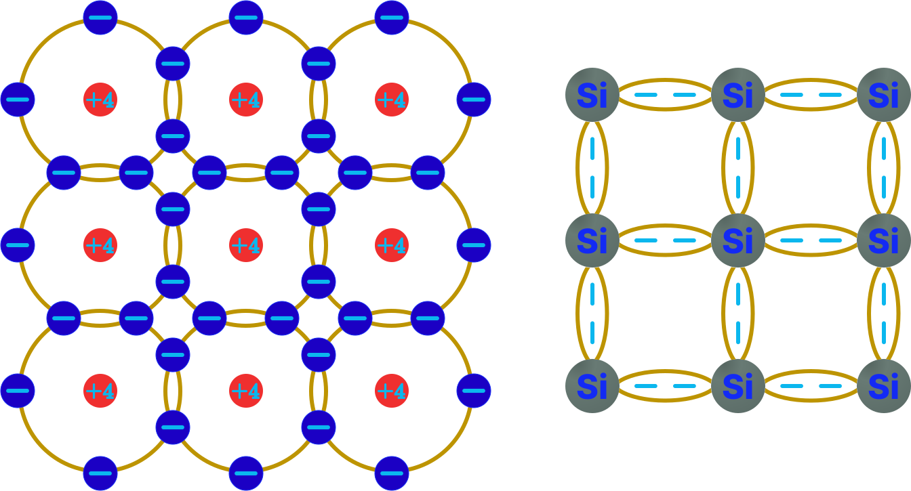
<p class="caption">Նկ․ (1.4)։</p>
:::

Իդեալական ցանցում բոլոր էլեկտրոնները կապված են ազատ լիցքակիրներ չկան հետևաբար արտաքին էլ․ դաշտի ազդեցությամբ հոսանք չի անցնի։ Ազատ լիցքակիրներ ստեղծելու համար  անհրաժեշտ է էլեկտրոնը պոկել կապից որի համար պետք է ցանցին հաղորդել էներգիա դա կարող է լինել ջերմային կամ ֆոտոնի փոխանցած էներգիան։ Ազատ էլեկտրոնը սկսում է կատարել քաոսային շարժում ընդ որում այն կարող է հանդիպել չլրացված կապի և միանալ ատոմին տալով իր էներգիան ցանցին կամ լույսի քվանտ ճառագայթի։ Ազատ էլեկտրոնի ձևափոխումը կապված էլեկտրոնի կոչվում է ռեկոմբինացիա։ Ուշադրություն է անհրաժեշտ դարցնել որ յուրաքանչյուր ազատ էլեկտրոն ստեղծում է մեկ կիսատ կապ իսկ ռեկոմբինացիայից հետո ոչ միայն ազատ էլեկտրոնն է ձևափոխվում կապվածի այլ նաև լրանում է կիսատ կապը։ 

դիցուկ ազատ լիցքակիրներով կիսահաղորդիչը տեղադրում ենք արտաքին $E$ լարվածությամբ էլ․ դաշտում։ Ազատ էլեկտրոնները որոնք կատարում են ջերմային շարժում սկսում է ազդել ${ |Ee_{n}| }$ ուժ որը լիցքակիրներին դնում է դրեյֆային շարժման մեջ դաշտի լարվածության հակառակ ուղղությամբ։ Եթե նշանակենք $n$֊ով էլեկտրոնների կոնցենտրացիան իսկ $μ_{n}$֊ով շարժողունակությունը Հոսանքի խտությունը կլինի՝

```{=tex}
\begin{equation} 
  j_{n} = e_{n} μ_{n} n E = \sigma_n E:
  (\#eq:7)
\end{equation}
```
Որտեղ $e_{n}$֊ը էլեկտրոնի լիցքն է։ Կիսահաղորդիչներում ազատ լիցքակիրների կոնցենտրացիան իսկապես շատ խիստ է կախված արտաքին պայմաններից ջերմության կամ լուսաորություն փոքր փոփոխությունը  բերում է կոնցենտրացիայի մեծ փոփոխության իտարբերություն մետաղների որտեղ ազատ լիցքակիրների կոնցենտրացիան արտաքին ազդեցություններից գրեթե մնում է անփոփոխ։ Սակայն սա հաղորդիչների և կիսահաղորդիչների միակ տարբերությունը չէ։ Կիսահաղորդիչներում էլ․հաղորդականությանը մասնակցում են ոչ միայն էլեկտրոնները այլ նաև չլրացած կապերը։ Իսկապես էլեկտրոնների շարժման պատճառով չլրացած կապը կարող է շարժվել մի ատոմից միուսը կատարելով քաոսային շարժում։ Արտաքին դաշտի ազդեցությամբ վականտ էլեկտրոնները նույնպես սկսում են շարժվել դաշտի հակառակ ուղղությամբ այսպիսով մասնակցելով էլ․հաղորդականությանը։ Այդ հոսանքի խտությունը կլինի՝

```{=tex}
\begin{equation} 
  j_{N} = e_{n} μ_{N} N E:
  (\#eq:8)
\end{equation}
```
որտեղ $μ_{N}$֊ը չլրացած կապի շարժողականությունն է իսկ $N$֊ը դրանց կոնցենտրացիան է։ Այսպիսով հոսանքի խտություն համար կարող ենք գրել՝

```{=tex}
\begin{equation} 
   j = j_{n} + j_{N} = (e_{n} μ_{n} n  + e_{n} μ_{N} N )E:
  (\#eq:9)
\end{equation}
```

Հարմարության համար կապված էլեկտրոնների բազմության փոխարեն դիտարկում ենք վականտ կապի շարժումը որի ուղղությունը համնկնում է դաշտի լարվածության ուղղության հետ։ Այսպիսով վականտ կապի շարժումը էլ․ դաշտում համարժեք է $e^{+}$ դրական լիցքի շարժմանը սակայն պետք է միշտ հիշել որ իվերջո այդ շարժումը էլեկտրոնների շարժում է։ Վականտ կապի կենցենտրացիան հիմնականում ընդունված է նշանակել $p$֊ով իսկ դրանց շարժողունակությունը $μ_{p}$֊ով։ Այսպիսով վականտ կապի շարժումով պայմանաորված հոսանքի խտությունը կլինի՝ 

```{=tex}
\begin{equation} 
   j_{p}  = e_{p} μ_{p} p E:
  (\#eq:10)
\end{equation}
```

## ՌԵԶԻՍՏՈՐՆԵՐԻ ԶՈՒԳԱՀԵՌ և ՀԱՋՈՐԴԱԿԱՆ ՄԻԱՑՈՒՄ։ 

:::{.imige-center-100 }
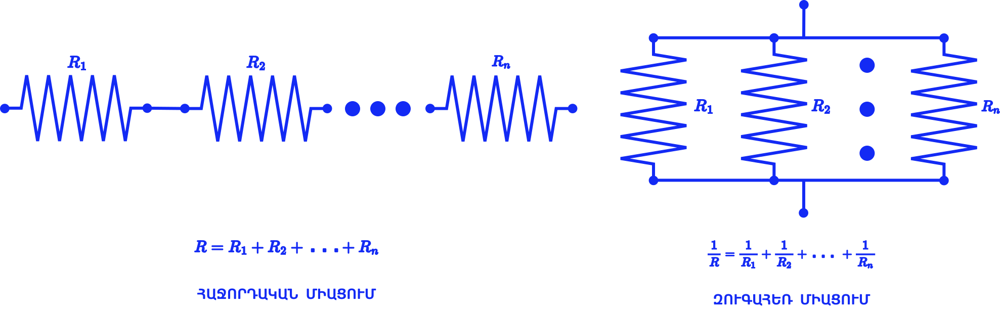
<p class="caption">Նկ․ (1.1)։</p>
:::

Նկարում պատկերված են ռեզիստորների հաջորդաբար և զուգահեռ միացումներ։

-   Ռեզիստորների հաջորդաաբար միացման դեպքում ընդհանուր դիմադրությունը կլինի՝ $R = R_1 + R_2 + ... +R_n$։


-   Ռեզիստորների զուգահեռ միացման դեպքում ընդհանուր դիմադրությունը կլինի՝ ${\smash{1/R} = \smash{1/R_1} + \smash{1/R_2} + ... + \smash{1/R_n}}$։


## ԼԱՐՄԱՆ ԲԱԺԱՆԱՐԱՐ։

:::{.img-text-box}
:::{.imige-left }

<p class="caption">Նկ․ (1.1)։</p>
:::
:::{.text-box}
Առաջին ամենապարզ սակայն կարևոր շղթան որի մասին կխոսենք դա նկարում պատկերված երկու ռեզիստորների հաջորդաբար միացումն է։ Ակնհայտ է որ երկու ռեզիստորներով անցնող հոսանքի ուժը իրար հավասար են և որոշվում է $I =\smash{V_{in}/{(R_1 + R_2)}}$ արտահայտությամբ։ Այսպիսով $R_1$֊ի սեխմակների միջև պոտենցիալների տարբերությունը կլինի $V_{out} = \smash{V_{in} R_1 / {(R_1 + R_2)}}$։ Երբ $R_1$֊ը բավական փոքր լինի $R_2$֊ի նկատմամբ կամ 0 դրանից իսկույն կհետևի որ $R_1$ ռեզիստորի վրա ընկած պոտենցիալների տարբերությունը 0(Վ) կլինի։ Միուս դեպքում ելքի լարումը կլինի՝

```{=tex}
\begin{equation} 
   V_{out} = \frac{V_{in}}{1+ \frac{R_2}{R_1}}:
  (\#eq:11)
\end{equation}
```
Ինչպես տեսնում ենք ելքում նույն լարումը կարող ենք ստանալ երբ ${\smash{R_2/R_1}}$ հարաբերությունը նույնն է։ Քանի որ շղթան պարունակում է միայն ռեզիստորներ որոնք գծային պասիվ տարեր են ապա կատարված եզրակացությունները ճիշտ են նաև փոփոխական լարման դեպքում։
:::
:::

## ԿՈՆԴԵՍԱՏՈՐ։

Կոնդեսատոր ինչպես նաև հաճախ անվանում են ունակություն՝ այն սարքերն են որոնք ունակ են կուտակել էլեկտրական լիցք։ Պարզագույն կոնդեսատոր է հանդիսանում երկու ${S}$ մակերես ունեցող մետաղական թիթեղները որոնց միջև հեռաորությունը ${d}$ է։ 


:::{.img-text-box}
:::{.imige-left }
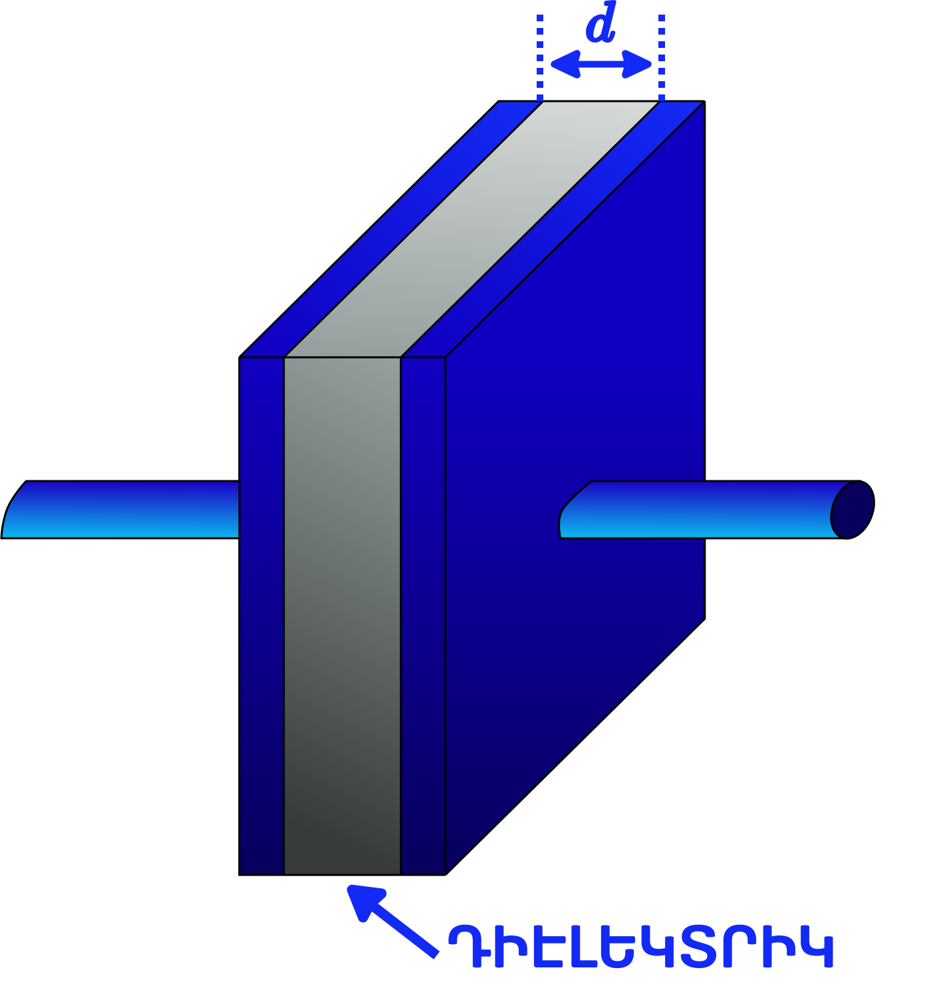
<p class="caption">Նկ․ (1.1)։</p>
:::
:::{.text-box}
Նկարում պատկերված է հարթ կենդեսատոր, որի թիթեղների միջև եղած տարածությունը լցված է ${Ɛ}$ դիէլեկտրիկ թափանցելիություն ունեցող դիէլեկտրիկով։ Երբ կոնդեսատորը միացնենք արտաքին լարման աղբյուրին, որի պոտենցիալների տարբերությունը դիցուկ ${V=1(Վ)}$ է։ Եթե հետևենք հաղորթալարերով անցնող էլ․ հոսանքին կտեսնենք որոշ ժամանակահատվածում աննդհատ նվազող հոսանք որը իվերջո հավասարվում է 0֊ի։ Երկու թիթեղների միջև պոտենցիալների տարբերությունը այլևս 0 չի լինի։ նշանակում է թիթեղների միջև պետք է առաջանա այնպիսի էլ․ դաշտ՝ որ այդ դաշտի ստեղծած պոտենցիալների տարբերությունը թիթեղների վրա հավասարվի արտաքին աղբյուրի պոտենցիալների տարբերությանը։ Հետևաբար թիթեղները պետք է լիցքաորվեն մեծությամբ հավասար նշանով հակառակ այնպիսի ${Q}$ լիցքով, որ միաոր դրական լիցքը բացասական լիցքաորված թիթեղից մինչև դրական լիցքաորված թիթեղը տեղափոխելու համար կատարած աշխատանքը հավասարվի ${W=V(Ջ)}$֊ ի՝ մեր դեպքում ${1(Ջ)}$։ Եթե ընդունենք, որ թիթեղները բավական հարթ և համասեռ են ինչպես նաև իրար շատ մոտ ապա ներքին դաշտը կլինի համասեռ էլեկտրական դաշտ։ այստեղից էլ կարող ենք կատարել հետևյալ եզրակացությունները՝
:::
:::


-   Որքան մոտ լինմեն թիթողները այնքան շատ լիցքեր կպահանջնի կուտակել նույն արտաքին լարման աղբյուրի դեպքում։
-   Որքան մեծ լինի դիէլէկտրիկի ${Ɛ}$ թափանցելիությունը այնքան շատ լիցքեր կպահանջվի։
-   Որքան մեծ լինի թիթեղների մակերեսը էլի պահանջվող լիցքերի քանաքը կմեծանա։

```{=tex}
\begin{equation} 
   C = {Q\over U} = {Ɛε_0 S\over d}:
  (\#eq:1)
\end{equation}
```
Որտեղ՝
-   ${C}$-ն կոնդեսատորի ունակությունն է։
-   ${Ɛ}$-ը դիելեկտրիկի թափանցելիունը։
-   ${ε_0}$ Հաստատուն մեծություն է այն վակումի դիելեկտրիկ թափանցելիունն է։ 
-   ${S}$-ը թիթեղների մակերեսը։
-   ${d}$-ն թիթեղների միջև հեռաորությունը։

Շատ կարևոր է նշել որ յուրաքանչյուր կոնդեսատոր ինչ տիպի էլ լինի այն ունի կուտակած լիցքի իր առավելագույն արժեքը, որից ավել լիցք չի կարող կուտակել՝ իսկապես շատ հեշտ կարելի է բացատրել պատճառներից մեկը ունենալով որպես լավ օրինակ էլեկտրաստատիկ մեքենան չէ որ երկու գնդերի լիցքի որոշ արժեքի դեպքում տեղի է ունենում պարպում։ Տեղին համեմատական է տակառը որի տարողունակությունը կարծես ունակությունը լինի։ Հեշտ է նաև ցույց տալ, որ զուգահեռ միացման դեպքում համարժեք ունակությունը հավասար կլինի առանձին ունակությունների գումարին, իսկ հաջորդաբար միացման դեպքում համարժեք ունակության հակադարձը հավասար կլինի առանձին ունակությունների հակադարձների գումարին։ 

:::{.imige-center-100 }
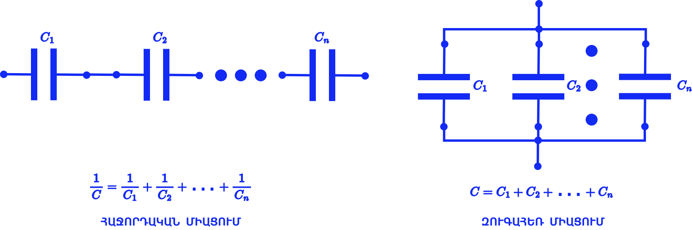
<p class="caption">Նկ․ (1.1)։</p>
:::

Ըստ կառուցվածքի կարող են լինել ոչ միայն հարթ այլ գնդաին գլանաին և այլ կառուցվածք ունեցող կոնդեսատորներ։ Որպես կոնդեսատոր կարող է հանդես գալ նաև երկու հաղորդալարեր, որը հաճախ համարում ենք պառազիտիկ հատկություն քանի որ շղթան նախագծելիս հաղորդալարերը օգտագործվում են հաղորդականության համար։ Այդպիսի կոնդեսատորի ունակությունը կախված է հաղորդալարերի երկարությունից հաստությանից և դրանց միջև ընկած հեռաորությունից։ կախված կիրառման պայմաններց՝ բարձր և արագ փոփոխվող լարումների համար որպես դիէլէկտրիկ օգտագործում են հատուկ կերամիկաի տեսակներ, իսկ որպես շրջադիրներ հանդես են գալիս կերամիկաի վրա նստեցված մետաղական շերտ այսպիսի կոնդեսատորներին անվանում են կերամիկական։ Մեծ ունակություններ ստանալու համար օգտագործում են էլեկտրոլիտիկ կոնդեսատորներ որտեղ որպես դիէլեկտրիկ հանդես է գալիս օքսիդ։ էլեկտրոլիտիկ կոնդեսատորների ելուսները ունեն պոտենցիալների տարբերություն ուղղություն։ Հակառակ լարման դեպքում դիելեկտրիկի քիմիական կառուցվածքը քանդվում է սկսում է կոնդեսատորով անցնել հոսանք, որի հետևանքը որպես կանոն պատյանի պայթունն է։ Գոյություն ունեն նաև այլ տիպի կոնդեսատորներ։ 

### ՊԱՌԱԶԻՏԻԿ ՀԱՏԿՈՒԹՅՈՒՆՆԵՐԸ։

:::{.img-text-box}
:::{.imige-left }
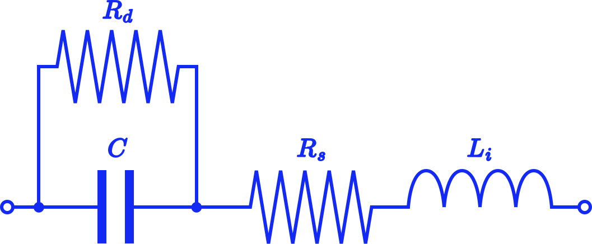
<p class="caption">Նկ․ (1.1)։</p>
:::
:::{.text-box}

նկարում պատկերված է իրական կոնդեսատորի համարժեքը։ Զուգահեռ դիմադրությունը պայմանաորված է դիելեկտրիկի ունեցած որոշ հաղորդականությամբ, որը պատճառ է հանդիսանում լիցքաորված և շղթայից անջատված Կոնդեսատորի ժամանակի ընթացքում լիցքաթափմանը։ Հաջորդաբար միացված դիմադրությունը պայմանաորված է ելուսների, թիթեղների և ելուսների կոնտակտի դիմադրություններով։ Ինդուկտիվությունը պայմանաորված է թիթեղների, կոնտակտների ինդուկտիվությամբ։ Արդյունքում կենդեսատորը վերածվում է տատանողական կոնտուռի։

:::
:::


###  ԿՈՆԴԵՍԱՏՈՐԻ ԷՆԵՐԳԻԱՆ։

Այժմ հաշվենք արտաքին ${V}$ լարումից լիցքաորված ${C}$ ունակությամբ կոնդեսատորի էներգիան։ Դիցուկ կոնդեսատորի լիցքաորումից հետո այն անջատել էնք արտաքին աղբյուրից և միացրել ենք ${R}$ դիմադրությամբ ռեզիստորին։ Որոշակի ${τ}$ ժամանակ շխթայով կանցնի հոսանք՝ ընդ որում այն միշտ ժականակի ${t}$ պահին ավելի փոքր կլինի քան նախորդ ${t-Δt}$ պահին՝ այսինքն ըստ ժամանակի նվազող ֆունկցիա է քանի, որ այդ հոսանքը նույն թիթեղների վրա կուտակված լիցքերի շարժումն է որը և ստեղծում է պոտենցիալների տարբերություն։ Ենթադրնեք որ կոնդեսատորի պարպման ընթացքում նրա շրջադիրների լարման ակնթարթային արժեքը ${V_{աթ․}}$ է իսկ շխթայով կանցնի այնպիսի փոքր  ${dq}$ լիցք, որ ${V_{աթ․}}$-ն նույնը կմնա։ Այսպիսով ներքին էլ․ դաշտի կատարած աշխատանքը կլինի՝

```{=tex}
\begin{equation} 
   dA=V  dq:
  (\#eq:1)
\end{equation}
```
${dq}$-ն փոխարինելով՝

```{=tex}
\begin{equation} 
   dq= C  dV:
  (\#eq:1)
\end{equation}
```
կունենանք՝
 
```{=tex}
\begin{equation} 
   dA = {C \cdot V dV}:
  (\#eq:1)
\end{equation}
```
Ինտեգրենք ստացված հավասարումը


```{=tex}
\begin{equation} 
   A = W = \frac{CV^2}{2} =  \frac {q^2}{2C}:
  (\#eq:1)
\end{equation}
```

### ԿՈՆԴԵՍԱՏՈՐԻ ՌԵԱԿՏԻՎ ԴԻՄԱԴՐՈՒԹՅՈՒՆԸ։

Էլ․ շղթաներում տարերը կարող են լինել՝

-   Ակտիվ
-   Պասիվ
-   Ռեակտիվ

Ակտիվ՝ կանվանենք այն տարերը որոնք միայն աշխատանք կկատարեն այսինքն նրանցից միշտ կանջատվի էներգիա։ Որպես այդպիսին կարող են հանդես գալ իդեալական լարման կամ հոսանքի աղբյուրները։ Պասիվ՝ տարերը այն տարերն են որոնց վրա միշտ անջատվում է էներգիա ջերմային, լուսային և այլն։ Ռեակտիվ՝ տարերը այն տարերն են որոնք կարող են հանդես գալ և բեռ՝ օր․ մարտկոցը լիցքաորվելիս և որպես աղբյուր օր․ երբ նույն մարտկոցը սնուցում է շխթան։ Ընդ որում երեք տեսակների համար էլ կասենք տարրը գծային է եթե ՎԱԲ֊ը գծային է հակառակ դեպքում ոչ գծային։

Դիտարկենք $C$ ունակությամբ իդեալական կոնդեսատոր։ Ըստ կառուցվածքի կոնդեսատորով հոսանք չպետք է անցնի քանի որ երկու թիթեղները անջատված են դիէլեկտրիկով։ Միուս կողմից լիցքաորված կոնդեսատորը ունի էներգիա նշանակում է լիցքաորման ընթացքում պետք է հոսանք անցնի որպիսի աղբյուրից անջատվի էներգիա, իսկ լիցքաթափման ընթացքում կոնդեսնատորն է համարվում աղբյուր և կրկին շղթայով պետք է հոսանք անցնի: Այսպիսով կոնդեսատորով փակված շղթայում լարման փոփոխությունը պատճառ է հանդիսանում, որ շղթայով անցնի այնպիսի հոսանք որպիսի կոնդեսատորի թիթեղների միջև ներքին դաշտի լարվածությունը հետևի արտաքին պոտենցիալների տարբերությանը։ Ինչպես գիտենք ներքին էլ․ դաշտը թիթեղների վրա կուտակած լիցքակիրների հետևանքն է իսկ դրանց քանաքի փոփոխության համար անհրաժեշտ է որոշակի ժամանակ, որի ընթացքում լիցքակիրները կտեղափոխվեն հետևաբար որքան էլ ցանկանաք երբեք չէնք կարողանա կոնդեսատորը լիցքաորել կամ լիցքաթափել զրո ժամանակում։ Կրկին կարող ենք համեմատել տակառի հետ, որի պարունակության փոփախության համար անհրաժեշտ է ժամանակ։ 

:::{.img-text-box}
:::{.imige-left }
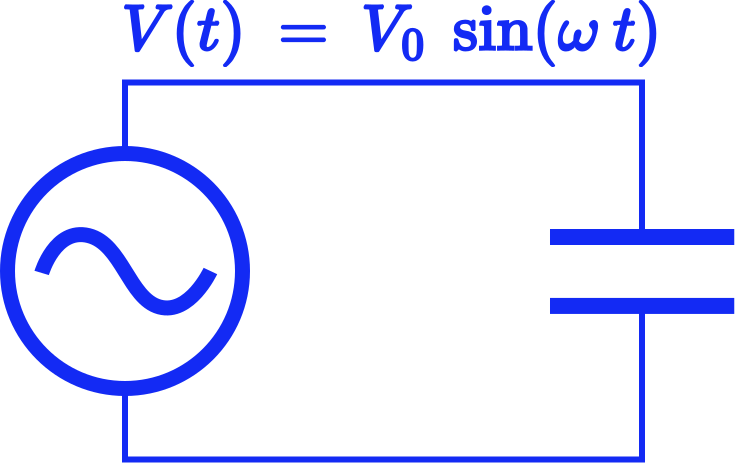
<p class="caption">Նկ․ (1.1)։</p>
:::
:::{.text-box}
Քննարկենք նկարում պատկերված միացումը ընդունելով որ աղբյուրի և հաղորդալարերի դիմադրությունը 0 է։ Առաջին քառորդ պարբերության ընթացքում աղբյուրի պոտենցիալների տարբերությանը աճում է ընդորում աճի արագությունը գնալով փոքրանում է հավասարվելով 0 ի։ Այդ ընթացքում կոնդեսատորը լիցքաորվում է՝ թիթեղներին կուտակված $Q$ լիցքը գնալով աճում է այնպես որ ներքին դաշտի լարվածությունը հետևի աղբյուրին։ Հետևաբար շղթայով կանցնի դրական հոսանք որի ակնթարթային արժեքը նույնպես գնալով նվազում է հասնելով 0 ի քանի որ ամեն հաջորդ պահին ավելի քիչ է փոփոխվում աղբյուրի լարումը ուստի ավելի քիչ լիցքերի տեղափոխություն է տեղի ունենում։ Երկրորդ քառորդ պարբերությունում աղբյուրի պոտենցիալների տարբերությանը նվազում է ընդորում գնալով ավելի արագ է նվազում։ Այդ ընթացքում կենդեսատորը լիցքաթափվում է թիթեղների $Q$ լիցքը գնալով նվազում է հետևաբար աղբյուրի պոտենցիալների տարբերության և շղթայով անցնող հոսանքի ուղղությունը չի համնկնում ուստի շղթայով անցնում է բացասական հոսանք որի ակնթարթային արժեքի մոդուլը գնալով մեծանում է։ երրորդ և չորրորդ պարբերությանները նույնությամբ կրկնում են առաջին և երկրորդ պարբերություններին միայն այն տարբերությամբ որ աղբյուրի պոտենցիալների տարբերության ուղղությունը փոփոխվում է։  
:::
:::

Եթե  շղթայում լարման ակնթարթային արժեքը $dt$ ընթացքում փեփոխվել է $dV$-ով՝ նշանակում է թիթեղների լիցքը այդ ընթացքում փոփոխվել է ${dq=CdV}$-ով։ Հետևաբար հոսանքի ուժի ակնթարթային արժեքը կլինի՝
 
```{=tex}
\begin{equation} 
   I = \frac{dq}{dt} = \frac{CdV}{dt}:
  (\#eq:1)
\end{equation}
```

 Տեղադրելով $V = V_0 \sin{(\omega t)}$ կստանանք՝

```{=tex}
\begin{equation} 
   I = CV_0\omega  \cos{(\omega t)} = CV_0\omega  \sin{(\omega t+ \frac{π}{2})}։
  (\#eq:1)
\end{equation}
```

 

 Ինչպես տեսնում եմք ունակությունը քառորդ պարբերությունով շեղում է հոսանքի ուժը։ Որտեղ hոսանքի ուժի ամպլիտուդը կլինի՝

```{=tex}
\begin{equation} 
   I_0 = \omega  C V_0 ։
  (\#eq:1)
\end{equation}
```
:::{.imige-center-100 }
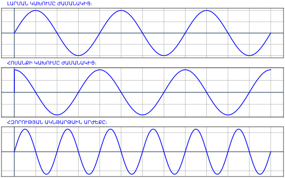
<p class="caption">Նկ․ (1.1)։</p>
:::

Եթե վերցնենք լարման և հոսանքի գործող արժեքները Օհմի օրենքի համաձայն կոնդեսատորի դիմադրության համար կունենանք՝

```{=tex}
\begin{equation} 
   Z_c = \frac{1}{\omega C}:
  (\#eq:1)
\end{equation}
```

Իրական կոնդեսատորը իտարբերություն իդեալականի ունի նաև կորուստների դիմադրություն, իսկ բարձր հաճախություններում նաև պարազիտիկ ինդուկտիվություն։ Հետևաբար երբեք հնարավոր չի լինի մեկ ունակությամբ լարման և հոսանքի փուլերը շեղել $\frac{{pi}}{2}$-ով։

:::{.img-text-box}
:::{.imige-left }
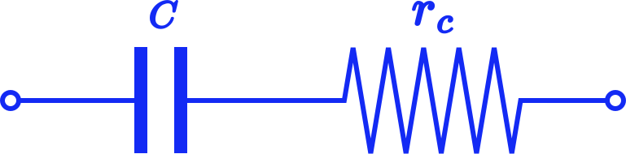
<p class="caption">Նկ․ (1.1)։</p>
:::
:::{.text-box}
Դիտարկենք նկարում պատկերված իրական կոնդեսատորը՝ որտեղ պարզության համար անտեսված է պառազիտիկ ինդուկտիվությունը և զուգահեռ դիմադրությունը։ Ընդհանուր դիմադրության հաշվարկի համար կառուցենք փուլային վեկտորական դիագրամա։
:::
:::

:::{.img-text-box}
:::{.imige-left }
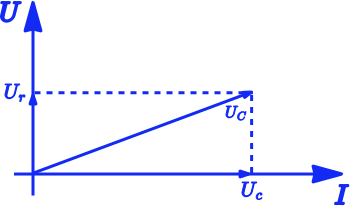
<p class="caption">Նկ․ (1.1)։</p>
:::
:::{.text-box}

:::
Ինչպես գիտենք $r$ պառազիտիկ դիմադրությունը չի շեղում լարման և հոսանքի միջև փուլը 


:::
 


```{r include=FALSE}
knitr::write_bib(c(
  .packages(), 'bookdown', 'knitr', 'rmarkdown'
), 'packages.bib')
```
